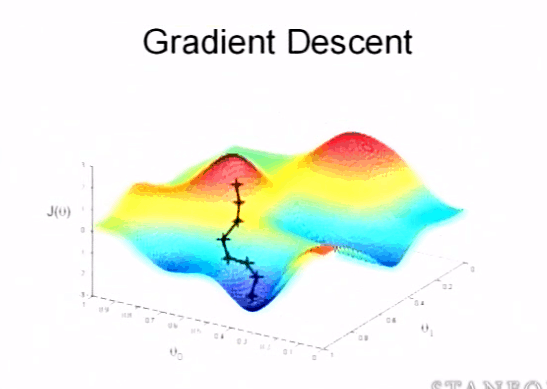

## What is Logistic regression?

One could say that it is the counterpart of the linear regression model, but adapting the process to classification problems. As we have explained previously, the classification problems, unlike the regression problems, work with target variables that they are categorical, so we enter the terrain of predicting the categorical value of Y for a series of inputs X, where Y has defined labels and is not a continuous number (as seen in the linear regression.) but a usually small variations of discrete numbers. The most common is to work with binary variables.

Beyond these differences, the utility of the logistic regression is the same as that of the linear regression. to explain the linear relationship between one or more features, with a target variable.

### Understanding the relationship equation

Just like in the linear regression, there are three things we ought to consider to effectively execute the model.

The first is understanding the equation that is going to express the relationship between the variables, and for which our algorithm is going to optimize itself.

Well let's see the logic behind this. On one hand, we have that the function is curiously P(x), although on a practical level it does not matter if we put H(x) or Y at this point, there is a logical reason why P(x) is used. Recall that in this scenario, Y is a categorical variable, the prediction, in essence, is not a number, but mathematics can only work with numbers. We have a problem.

The first thing we need to do is to convert the different categories of Y into numbers that mean something, the way that the mathematicians who created this method found was to convert the categories of Y into a numerically binary variable, that is, a variable that can have only two values possible. 1, if the category occurs in that interaction of Y (say if Y has that category it represents) and 0 if it does not occur. Basically labels, such as "red", "fraud", "approved" or "sold", would be mathematically translated objectively if they happen, or if they don't happen in that interaction of the sample.

Taking this into account, now we can perhaps understand where that P (x) comes from, it is the probability. The equation that I just showed you, and that we are going to use will transform the linear relationship that exists between X and Y, in a number between 0 and 1, this number will be a mathematical representation of the probability that those inputs of X generate a 1 (that is, that the category we are trying to predict happens).

Ok, we already understand the objective of the equation, it is time to go on and understand what is on the right of equality. It is really very simple.

Let's start with our linear model equation.

This will continue to be the main equation to explicate the relationship between the variables X and our Y, all we will do is operate on it and modify it to ensure that the values that are generated from it, are between 0 and 1, instead of continuous numbers that can go from - infinity to + infinity.

We know that probabilities are always positive, so what we will do is make that linear relationship really be the exponent of a number that way we can keep the relationship between the variables (even if it is inverse or directly proportional, negative or positive) but the number generated will always be a positive number that adequately represents that relationship. We choose that the linear relationship is an exponent of the number e.

Here B0 is the intercept, B1X is the feature and the coefficient, you can guess that more features would translate in more B2x, B3x.... . Basically, we took the linear equation and made it the power of the e number.

#### But why the number e?

The reason why we choose the number e, and not any other number such as 10 or 2, is because it is going to be necessary, as in linear regression, to optimize the different betas and intercept that make up the same. That is why we are interested in maintaining an easily derivable equation at all times (in order to apply algorithms such as gradient descent), it is demonstrated that the derivative of the number e is the e-number itself, only affecting its exponent in the process. This makes the number e the best candidate for this job, as it translates the optimization process to just work on the power of e, the linear relationship we are optimizing.

Ok so we managed to make the values that are going to be produced, always positive. Now the next step is to ensure that the values, now positive always, are located in a range between zero and 1. To do this it will be necessary to divide our current number by a number greater than itself. We have to be careful here because we want to but make sure not to lose the essence of the relationship that we want to obtain, so What we will do is use it itself as the divider, adding 1, as simple and easy as that.

The end result we see is just a simplification of this.

## Cost function and Cost algorithm

The algorithm that is usually used is again gradient descent, and later you will see that, on a practical level, the final result of its application is practically the same as that seen in the linear regression.

Where we do see significant changes is in the cost function, to the point that the one we use in the linear regression will not be of use in this situation. The reason is because of the type of transformations we perform on the generated value P(x), which cause the cost function no longer to have a convex shape (or at least convex enough to exceed its local optimum with the learning rate), alpha). If we tried to use gradient descent to find the cost function we use, The result would be, more or less so that you understand it, something similar to this, but in the dimensions that correspond to it.

It becomes very difficult to apply gradient descent to reach the global optimum in this case. But enough hypothesizing, let's talk about the real deal.

Except for the transformations that we will do to avoid this problem, the cost function for logistic regression works the same way, it is a sum of the value that is generated to represent the difference between H(x) or P(x) in this case, and the original Y, representing a function J(θ)

I will now describe you what that Cost(H(x),y) is all about,

To avoid the aforementioned problem, the cost function used for logistic regression is a function that seeks to penalize a lot the errors committed, since the real value of Y is always found in values that are either zero or 1, and the The predicted value of Y will always be between 0 and 1, it means that the errors (the difference between the predicted value, and the value that will actually correspond (0 or 1) will be mathematically very small, they will never be greater than 1. This is the reason why we can't just use the same cost function and metric as in linear regression.

For this reason the cost function will compare the prediction of P (x) with the respective Y, and it will execute a different process if the value of the predicted hypothesis is 0 or 1, causing that, if the difference between both is zero because they are equal, the cost function equals zero, but if there is a difference, it will transform that mathematically small number that is between 0 and 1, and try to get it closer to infinity.

We must bear in mind that depending on the type of case, the error may end up being much greater or much smaller, (when the predicted value was 1, but the real value was 0, it means that the difference will be negative, but if the predicted is 0 and the real is 1, it will be positive, both scenarios must be transformed so that the error approaches infinity, which is why the cost function is really a system of equations.

In case you do not know, a logarithm when represented as seen here, calculates that number that must be raised to 10, to get the number to the right of the logarithm. When you put a number below, it is to what number you have to raise that number down to get the number to the right of the logarithm. For

Logarithm of 3 for 9, is 2. It's solution is 2, obviously,because 3² = 9.

Well, when there is no number below, we are assuming the number is 10, so what we are calculating is that number to which we have to raise 10, to get the specified number. With This system of equations what you are doing is increasing the size of the cost.H(x) will be located between 0 and 1, to reach that number it will be necessary to raise 10 to a negative exponent.

For example, imagine that the target value produced in that interaction is 0.4, this is the same as 4 multiplied by 10 raised to -1 (its logarithm, in this case, would be 4), and a number like 0.0000000056, would be the same as 0.56 x 10-8. We use the logarithm because that way we can use the information obtained, but increasing the error property significantly, allowing for a more significant correction when applying gradient descent.

Now, the equation systems can not get into our algorithm, we need to transform this into a single equation that represents our cost function. Mathematically speaking, the function you just saw is equivalent to the following:

Being the end result for the cost function, like this:

## Cost algorithm : Gradient Descent in logistic regression

Basically what we do, is the same process to update the variables as we used in linear regression, only that now the cost function changes. We will seek to update all the values of the different θ that are part of the linear regression equation (what we have called b and m) only now they are located in a sigmoidal, non-linear function.

And for that what we will do is subtract each one of the coefficients of relation by partial derivative of the cost function, for the alpha learning rate.

J( θ ) Represents the cost function, putting it here is the same as putting the entire formula

Mathematically, this may seem like magic to you, but it is equivalent to the following expression. (That is why we have chosen to work with the number e)

So the cost algorithm looks like this.

<figure>

<figcaption>

  

</figcaption>

</figure>

Remember that here H(x) is our sigmoidal function, the same this as placing P(x) there.

Basically, the gradient descent will update the theta values for each of the Theta coefficients, by subtracting their gradient, applying the cost function we saw earlier where the error between predicted Y and Y is elevated through logarithms.

Properly finding it's way to global optima.

## Multiclass logistic regression

For problems where the dependent variable explained has not only a binary value, but it has up to 4 possible categorical values, we can convert it into numeric assigning values from 1 to 4 (or from 1 to 3) for each of these categories, and use the Logistic regression multiclass. We rely on an algorithm called "one vs all".

The numbering can also be from 0 to 3. What we do is divide the problem into 3 or 4 binary regressions where there are only two values true (for the representative category of said sub-regression) and false (for the rest of the categories) in this way the data of the rest of the categories serve as a training set to train what is not true. Well, finally at the time of predicting, we apply each of the sub regressions for each input, that sub regression that of a value of true that is higher (the greater probability that it is 1) we accept as true, thus establishing the prediction.
