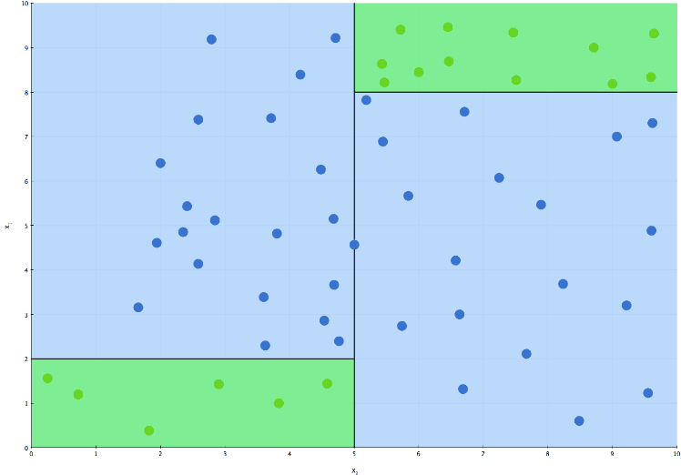
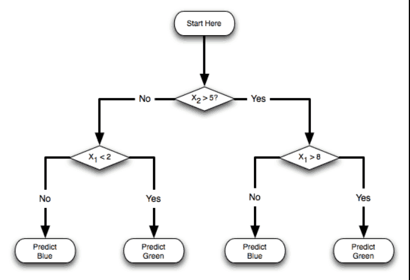
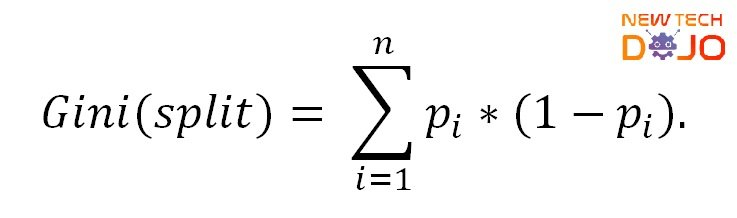
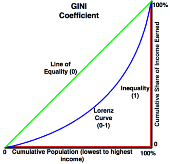
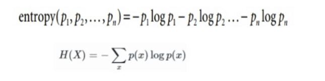
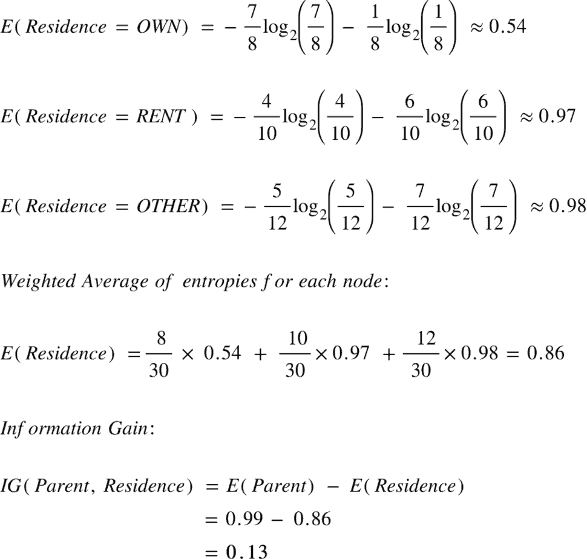

El algoritmo del árbol de decisión es muy especial, en el sentido de que funciona de forma un poco diferente a otros algoritmos al no calcular la relación de dos variables mediante una ecuación.

El modelo no calculará una función que represente las características de la relación objetivo. Más bien, definirá las separaciones más útiles de los datos en splits, optimizando para asegurarse de que los splits elegidos son los más relevantes matemáticamente para determinar los valores que queremos predecir en la variable objetivo.

Por ejemplo, imaginemos que tenemos un conjunto de datos en el que queremos calcular cuándo la gente abandona una empresa comparando los ingresos y la edad, el Algoritmo comprobaría todos los valores para los ingresos en el conjunto de entrenamiento, y todas las edades teniendo en cuenta si tienen 1 o 0 en la variable objetivo (abandono de empresa). Con él, encontrará la división en edad que más diferencia estadística puede verse para producir un 1 o un 0.

¿Cómo funciona realmente el proceso de división? La división consiste en dividir los conjuntos de datos en dos cuadrantes (cada cuadrante se convierte en su propio conjunto de datos) en función de un determinado criterio basado en una variable característica, por ejemplo, la edad es > 30 años. Esta división hará que un conjunto de datos sólo tenga valores para la variable edad donde la edad es exclusivamente >30 y el otro donde la edad es exclusivamente <30 Cada uno de esos conjuntos de datos también tendrá valores de 1 y 0 para la variable objetivo, el algoritmo entonces calculará cuánto de ambos tiene, determinando así la ganancia de información, cuán útil es la división para crear una separación del 100% entre 1 y 0 coherente con la división por edad. El objetivo es obtener una división que consiga colocar el 100% de 1 en un conjunto de datos, y el 100% de 0 en el otro. Para ello, tendrá que hacer este proceso de contar cuántos 1 y 0 tiene en cada conjunto de datos que se produce, teniendo en cuenta todos los posibles criterios de división para la variable de característica con la que está dividiendo. El algoritmo comprobará la ganancia de información de todos los criterios de separación posibles y elegirá el que considere que tiene la mayor ganancia de información. Después, reiniciará el proceso tantas veces como sea posible para esa variable. Cuando termine de separar a través de esa variable, utilizará otras en la última división para cada cuadrante.

Normalmente, es muy difícil conseguir una división del 100% en el primer intento, por lo que el algoritmo está diseñado para ser recurrente, creando más divisiones y más divisiones si determina que hay al menos una de cada valor en la misma división. Sólo dejará de crear divisiones cuando finalmente cree por completo un criterio que separe los posibles valores del objetivo, o alcance las condiciones que establezcamos para evitar el sobreajuste.

### Algoritmo de costes y función de costes

#### Índice Gini

Cómo funciona:

El índice de Ginis nos permite saber cómo de separada está la curva de la distribución con la que estamos trabajando, de la curva que representaría la igualdad entre las dos variables. Mide cuántas interacciones de la variable objetivo hay para cada interacción de la variable característica. Compara el área bajo la curva de igualdad perfecta que forma la curva de distribución. Cuanto mayor sea el área, mayor será el número de interacciones Y para interacciones X. Gini se calcula restando de 1 la proporción obtenida contando el número de veces que se da cada categoría y dividiéndola por el número total de muestras de datos del conjunto de datos. Una vez calculado ese número, se calcula la proporción de ese número con respecto al índice de Gini total de la división (ambos conjuntos de datos) teniendo en cuenta el número de muestras de cada uno. Si esa división está anidada, hay que calcular su valor proporcional en relación con el número de interacciones que se forman en el padre.

#### Entropía

Representa la mezcla de cada categoría posible hay en cada cuadrante de la división, la diferencia entre la probabilidad de que esa categoría sea A y la probabilidad de que sea B, basado en esa fórmula. Cuanto mayor sea la diferencia de probabilidades para cada categoría en cada cuadrante, mayor será la ganancia de información. , la entropía es más fácil de entender pero lleva más que calcular computacionalmente que el índice de impureza de ganancia (pero esto es más difícil de entender)

La entropía contará uno a uno todos los valores de las categorías de cada cuadrante, lo dividirá por el número total de interacciones del cuadrante y calculará así la probabilidad de cada categoría. Luego restará la probabilidad total con la probabilidad encontrada originalmente antes de hacer las divisiones. Ese será el nivel de entropía. En la función aplicamos un logaritmo para cada una de las probabilidades, porque eso le da al cálculo algunas propiedades interesantes y convenientes, permitiendo simplemente sumar la probabilidad de cada categoría en cada división a sus probabilidades en las divisiones anidadas.

La entropía es el valor negativo de la probabilidad de aparición de la categoría A (calculada dividiendo el número de veces que aparece A en el conjunto de datos del estudio por la cantidad de datos en general) multiplicado por el logaritmo de dos de esa probabilidad (la razón por la que se multiplica por el logaritmo de dos, es porque esto permite calcular fácilmente a qué potencia hay que elevar dos para tener en cuenta esa probabilidad. Este método surge en los primeros tiempos de la informática, como medida para representar la información en función de cuántas combinaciones de 1 y 0 se necesitan para representarla).

Todo esto se suma con la probabilidad de que la categoría sea B, multiplicada por el logaritmo de 2 de esa probabilidad. La razón por la que multiplicamos por "-" es porque, el logaritmo por dos de una probabilidad (es decir de un número entre 0 y 1) siempre acaba dando negativo, para compensar esto y evitar que la entropía sea un número negativo, cambiamos el signo.

Veamos la entropía con un ejemplo. Esto lo dejará super claro, pertenece a este post de aquí https://towardsdatascience.com/entropy-how-decision-trees-make-decisions-2946b9c18c8 pero es una imagen tan buena, que prácticamente se explica sola. Recuérdalo: Padre es la entropía antes de la división, el nodo "padre", el origen donde estaban todos los datos juntos.

### Resumir el proceso del árbol de decisión:

1) Probamos numerosas divisiones para todas las características y para todas sus  
valores que marcan la diferencia, computando la Ganancia de Información que cada uno nos aporta  
2) Elegimos la división que nos da más Ganancia de Información. En  
Como resultado, el conjunto de datos se divide en dos cuadrantes  
3)Repite los pasos 1 y 2 con cada uno de los dos cuadrantes,  
añadiendo sucesivamente divisiones. Cada nueva división añade un  
nivel de profundidad a nuestro árbol.

Terminamos el proceso:  
\- Cuando las dos clases están perfectamente separadas, o  
\- Cuando alcancemos la profundidad deseada (fijada por nosotros)

Descrédito: No soy propietario de ninguna de las imágenes utilizadas en este post, todas fueron extraídas de diferentes fuentes ( ¡tantas que no recuerdo!) si alguna de estas imágenes es tuya, por favor ponte en contacto conmigo para editar el post y dar la referencia correspondiente.
