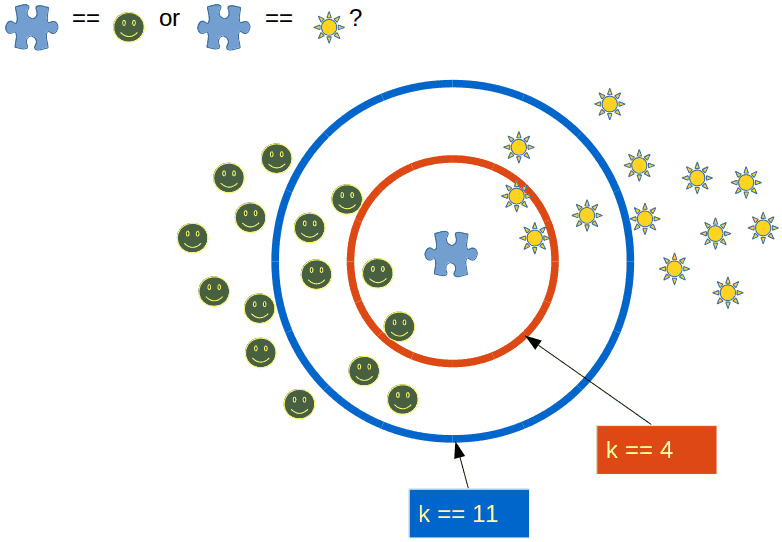
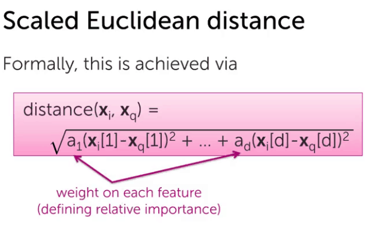
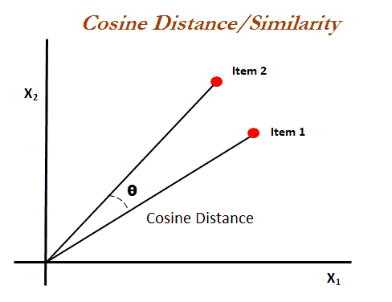
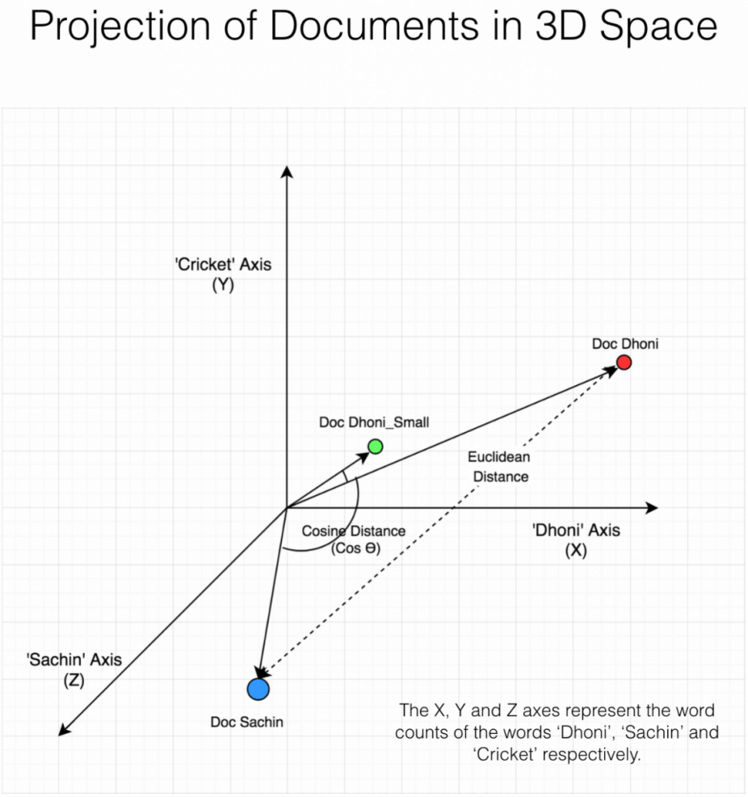
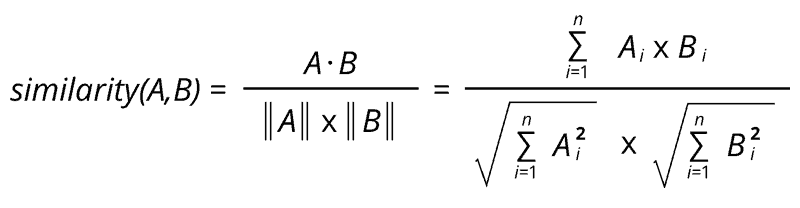

### ¿Qué son exactamente K vecinos más próximos?

Proporcionando un conjunto de entrenamiento que describe características como una distribución de coordenadas y una variable objetivo, vamos a estimar el valor de la variable predicha basando la estimación en el valor que tiene la coordenada más cercana de las variables de características en el conjunto de entrenamiento. Básicamente, cada vez que tenemos que predecir la variable Y, basándonos en una serie de características vamos a comprobar en nuestro conjunto de entrenamiento el resultado que se dio, para la combinación de valores de características que es la más "cercana" en la distribución, a nuestra combinación actual de variables de características.

Piénsalo así: si las características que utilizamos pueden expresarse como vectores en una representación gráfica, cada vector se traduce como una coordenada en el gráfico. Los K vecinos más cercanos funcionan comprobando todos los vectores guardados en el conjunto de entrenamiento y calculando qué vector tiene la menor distancia al vector de coordenadas utilizado como entrada para la predicción. Una vez recuperado ese vector más cercano, simplemente asignamos a la variable objetivo el valor que tenía en la muestra de entrenamiento. Si una muestra no nos basta para gestionar el riesgo, podemos intentar ser más rigurosos asignando en su lugar un número K de vectores con los que comparar. Si hacemos esto y asignamos por ejemplo K = 5, el algoritmo comprobará los 5 vectores más cercanos y el valor de la variable objetivo relacionado con ellos, entonces utilizará la media de ese valor ( en regresión) o la moda ( en clasificación) de esas 5 muestras de variable objetivo, para proporcionar la solución. Debido a que en la clasificación funciona con el modo, K siempre tiene que ser un número impar para evitar esta situación

### ¿Cómo funciona el algoritmo K vecino más próximo?

La clave para realizar los K vecinos más próximos es, por un lado, la k, pero por otro, la fórmula que utilizamos para medir la distancia.

Podemos trabajar con fórmulas de distancia que den más peso a una característica que a otras a la hora de calcular la distancia. Podemos afectar a cada característica con un coeficiente determinado, o podemos transformar las variables. Existen diferentes técnicas, y vamos a comprobar dos casos más utilizados, uno en el que añadimos coeficientes que representan el peso, priorizando unas variables en lugar de otras a la hora de calcular

#### Distancia euclidiana

Para que esta distancia se pueda representar en un plano haremos la fórmula de cálculo distancia 1 / distancia, que nos asegurará que toda distancia calculada entrará en un plano que va de cero a 1.

Pues bien, a esa fórmula de distancia podemos añadir los coeficientes a(x1 - xentrada) elevado a 2 + a2(x2-x2entrada) elevado a 2 + .... y así. La distancia es siempre igual a la entrada original menos la entrada característica del valor que debe predecirse, elevado a la potencia de dos. Restamos para obtener una medida de diferencia entre el punto con el que se está comparando y el que estamos utilizando, elevamos a la potencia de dos para asegurarnos de que la información se mantiene positiva a la vez que dotamos al cálculo de algunas propiedades beneficiosas (al igual que el error cuadrático medio) y a, es el coeficiente que estamos multiplicando para ponderar la circunstancia subjetiva o no tan subjetiva de cada característica.

Obviamente, esto tiene una clara representación en álgebra lineal, tratando todas las coordenadas como una matriz, la A como un vector, las coordenadas a predecir como un vector/matriz. Todo computacionalmente fácil de entender.

Podemos utilizar la misma fórmula para la distancia, sin coeficiente y estaríamos trabajando con un algoritmo funcional k vecino más cercano.

### Similitud coseno

Es una generalización del teorema de Pitágoras, que nos permite medir la distancia entre dos vectores, midiendo el coseno del ángulo entre ellos.

Equivale a calcular el coseno del ángulo formado por ambos vectores si formaran parte de un triángulo rectángulo. El lado imaginario que falta sería el que permite la formación del ángulo recto, y representaría la distancia. y el Es importante entender que no es una medida de distancia propiamente dicha, la ley del coseno es una generalización del teorema de Pitágoras (éste permite calcular cualquiera de los lados de un triángulo, conociendo la longitud de sus otros lados y su ángulo).

Vamos a profundizar un poco más en cómo esto funcionaría realmente cuando calculamos la distancia, tenemos un conjunto de características, ¿verdad? un vector de características sobre el que queremos predecir. Esencialmente, comprobaríamos uno a uno todos los vectores del conjunto de entrenamiento, comparándolos con nuestro vector de características para la predicción. Gráficamente, los vectores son coordenadas. Esas coordenadas pueden verse como parte de una función que pasa por el origen y esa coordenada ( lo que se conoce como vector libre). Si los imaginamos así, habremos formado un triángulo.

En esta situación, sólo falta un lado, ¿verdad? El lado del ángulo recto. ¿Ves como si pudiéramos calcularlo, representaría la distancia entre los dos vectores? Eso es lo que hacíamos con la distancia euclidiana ( si vuelves a comprobar la fórmula, ahí mismo está el teorema de Pitágoras). En la similitud coseno, calculamos el coseno del ángulo.

Aquí hay una imagen que puede servir como una buena comparación, la fuente original está aquí [https://www.machinelearningplus.com/nlp/cosine-similarity/](https://www.machinelearningplus.com/nlp/cosine-similarity/)

  
La fórmula es la siguiente

El coseno, es lo que medimos, entender el ángulo del triángulo puede ser tan efectivo como entender el tamaño exacto de la separación, cuanto mayor sea el ángulo, mayor será proporcionalmente el tamaño.

La fórmula del Coseno del ángulo entre dos vectores se obtiene a partir de la diferencia trigonométrica (entre el ángulo a y el ángulo b):

cos(a - b) = (cos(a) \* cos(b)) + (sin (a) \* sin(b)) Esta fórmula se parece mucho a la del producto punto:

Vect1 . Vect2 =_(x1_\* _x2_) + (y1 \* y2) donde cos(a) corresponde al valor x y sin(a) al valor _y_, para el primer vector, etc. El único problema es que _x, y,_ etc. no son exactamente los valores cos y sin, ya que estos valores deben leerse en el círculo unitario. Ahí es donde entra en juego el denominador de la fórmula: al dividir por el producto de la longitud de estos vectores, las coordenadas _x_ e _y_ se normalizan.

Ahora ya sabes todo lo que necesitas saber sobre las matemáticas que hay detrás del algoritmo K vecino más cercano. Pronto publicaré un ejemplo de código para complementar esta teoría.
