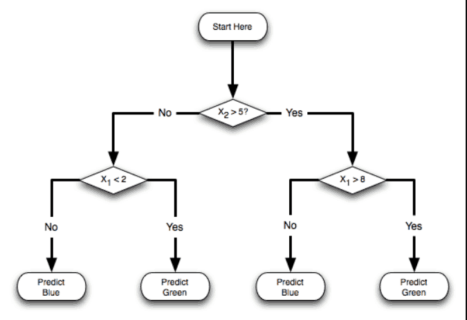
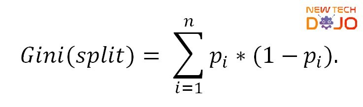

The decision tree algorithm is a very special one, in the sense that it works a little bit different from other algorithms by not calculating the relationship of two variables through an equation.

The model won't calculate a function that will represent features to target relation. Rather, it will define the most useful separations of data in splits, optimizing to make sure the chosen splits are the most mathematically relevant to determine the values that we want to predict on the target variable.

For example, let's imagine we have a dataset where we want to calculate when people abandon a company by comparing income and age, the Algorithm would check all the values for income in the training set, and all the ages taking in consideration if they have 1 or 0 in the target variable (company abandonment). With it, it will find the split in age that most statistical difference can be seen for producing a 1 or a 0.

How does the split process actually work? Splitting consists in dividing the datasets into two quadrants,(each quadrant becoming its own dataset) by a certain feature variable-based criteria, for example, age is > 30. This split will cause one data set to only have values for the age variable where age is exclusively >30 and the other one where age is exclusively <30 Each of those data sets will also have values of 1 and 0 for the target variable, the algorithm then will calculate how much of both it has, determining that way the information gain, how useful is the split in creating a 100% separation between 1 and 0 coherent with the age split. The objective is to get a split that manages to place 100% of 1 on one dataset, and 100% of 0 on the other. To do this, it will have to do this process of counting how many 1 and 0 has on each dataset that is produced, taking in consideration all the possible split criteria for the feature variable it is splitting with. The algorithm will check the information gain for all the possible separation criteria, picking the one that it finds has the most information gain. After that, it will restart the process as many times as possible for that variable. When it finishes separating through that variable, it will use others in the last split for each quadrant.

Usually, it is really hard to manage a 100% split on the first try, so the algorithm is designed to be recurrent, creating more splits and more splits if it determines that there is at least one of each value on the same split. It will only stop creating splits when it finally completely creates a criterion that separates the possible values of the target, or it reaches the conditions that we set to avoid overfitting.

### Cost algorithm and cost function

#### Gini index

How does it work:

Ginis index allows us to know how separated is the curve of the distribution we are working with, from the curve that would represent equality between the two variables. It measures how many Target variable interactions are there for each interaction of the feature variable. It compares the area under the curve of perfect equality that the distribution curve forms. The bigger the area, the bigger the number of Y interactions for X interactions. Gini is calculated by subtracting from 1, the proportion obtained by counting the number of times each category happens, and dividing that by the total number of data samples in the dataset. With that number calculated, the proportion of that number to the total Gini index of the split (both datasets) is calculated by taking into account the number of samples each. If that split is nested, then you have to calculate it's proportional value relative to the number of interactions that are formed in the parent.

#### Enthropy

Represents the mix of each possible category is there in each quadrant of the split, the difference between the probability for that category to be A and the probability for it to be B, based on that formula. The bigger the difference in probabilities for each category in each quadrant, the more information gain. , entropy is easier to understand but it takes more than calculating computationally that the impurity index of gain (but this is more difficult to understand)

Entropy will count one by one, all the values of the categories in each quadrant, divide it by the entire number of interactions of the quadrant and calculate that way the probability for each category. Then it will subtract the total probability with the probability originally found before doing the splits. That will be the level of entropy. In the function we apply a logarithm for each of the probabilities, because that gives the calculus some interesting and convenient properties, allowing to just add the probability of each category in each split to their probabilities in the nested splits.

Entropy is the negative value of the probability of occurrence of category A (calculated by dividing the number of times A appears in the study dataset by the amount of data in general) multiplied by the logarithm of two of that probability (the reason for which is multiplied by the logarithm of two, is because this allows you to easily calculate at what power you need to elevate two to take into account that probability. This method arises from the early computer days, as a measure to represent information depending on how many combinations of 1 and 0 are needed to represent it).

All this is added with the probability that the category is B, multiplied by the logarithm of 2 of that probability. The reason why we multiply by "-" is because, the logarithm for two of a probability (that is to say of a number between 0 and 1) always ends up giving negative, to compensate this and to avoid having the entropy being a negative number, we change the sign.

Let's look at entropy with an example. This will make it super clear, it belongs to this post over here https://towardsdatascience.com/entropy-how-decision-trees-make-decisions-2946b9c18c8 but it is such a good image, that it practically explains itself. Just remember: Parent is the entropy before the split, the "parent" node, the origin where all the data was together.

### Summarizing decision tree process:

1) We test numerous splits for all the features and for all their  
 values that make a difference, computing the Information Gain that each one gives us  
2) We choose the split that gives us more Information Gain. As  
 As a result, the dataset is separated into two quadrants  
3)Repeat steps 1 and 2 with each of the two quadrants,  
successively adding splits. Each new split adds a  
 level of depth to our tree.

We finish the process:  
 • When the two classes are perfectly separated, or  
 • When we reach the desired depth (set by us)

Discredit: I don't own any of the images used in this post, they were all extracted from different sources ( so many I can't remember!) if any of this images are yours, please contact me to edit the post and give the corresponding reference.
