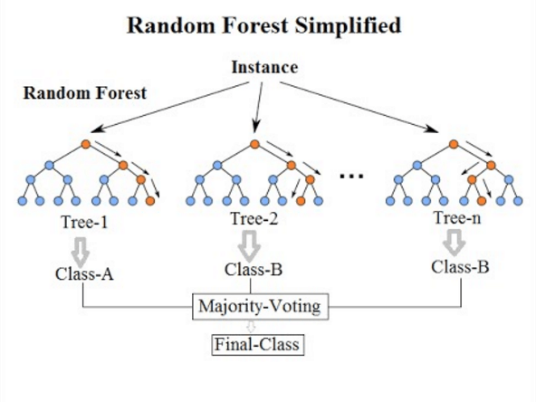
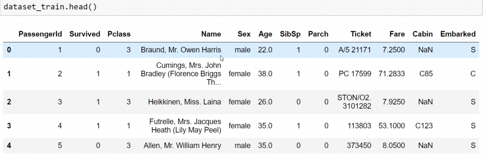
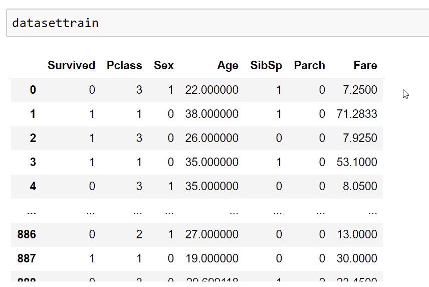
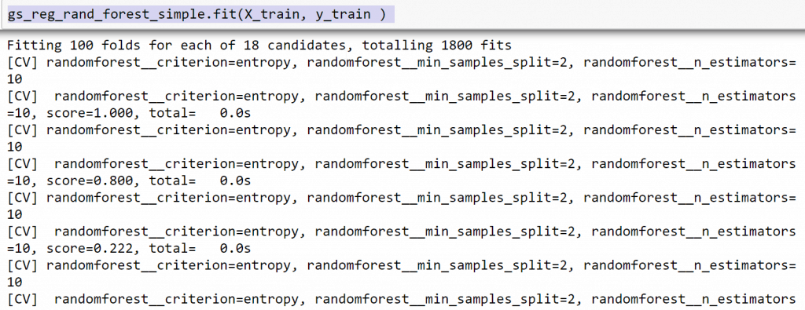
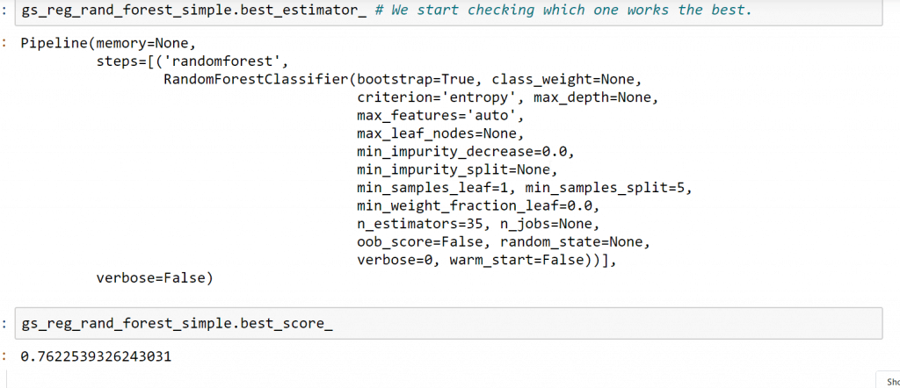

El bosque aleatorio es un tipo de algoritmo que consiste en un conjunto de múltiples árboles de decisión. Si aún no lo has hecho, te recomiendo que le eches un vistazo a este post sobre [árboles de decisión](/?p=2715&lang=es), ya que son esenciales para entender bien cómo funcionan los bosques aleatorios.

Básicamente lo que vamos a hacer es definir un tipo específico de árbol de decisión con su conjunto de hiperparámetros (nivel máximo de profundidad) y esencialmente crearemos muchos de ellos, cuantos más mejor. Cada división de cada uno de los árboles se realizará teniendo en cuenta sólo un subconjunto de todos los datos de características, permitiendo que cada árbol se entrene con diferentes conjuntos de entrenamiento y, por lo tanto, desarrolle diferentes criterios y relaciones matemáticas entre característica y objetivo , tal y como permite el algoritmo del árbol de decisión.

Podríamos decir que la forma en que los datos evaluarán cada división, es también un hiperparámetro, también podemos permitir que las observaciones de los subconjuntos de datos de cada árbol tengan repeticiones, todo esto se hace porque, principalmente lo que queremos tener son diferentes árboles que identificarán diferentes partes del espacio del problema, permitiendo que, en conjunto tomen en consideración más información que lo que un árbol de decisión individual podría manejar.

Finalmente, una vez que cada árbol está correctamente entrenado, comenzará a predecir, cada árbol hará su propia predicción individualmente y al final, como el algoritmo K vecinos más cercanos, la mayoría decidirá el resultado. En clasificación es una mayoría simple, mientras que en regresión tenemos medias.



Bastante sencillo, ¿verdad? Es aún más sencillo implementarlo con scikit learn , vamos a hacerlo utilizando el conjunto de datos titanic de kaggle.

El primer vástago consiste en importar los datos, como siempre

```
import pandas as pd 
dataset_train = pd.read_csv('train.csv')
dtaset_test = pd.read_csv('test.csv')
```



Limpiemos un poco los datos

```
# let's elminate collumns that do not provide usefull data 
datasettrain = dataset_train.drop(["Name", "Ticket" , "Cabin" , "Embarked" , "PassengerId"] , axis = 1)

# this will transform the categorical gender  variables, into a numerical one 
def categoricaltonum(dataset,category,mapdictionary):
    'this function transforms categorial variable of a dataset into numerical one, we specify as \
    arguments the dataset, the category we want to transform, and we use a dictionary to specify\
    which category will correspond to what created number afterwards'
    
    dataset[category] = dataset[category].map(mapdictionary)
    return(dataset)

# this is equivalent to : winedata['color'] = winedata['color'].map({'red': 1, 'white': 0})


categoricaltonum(datasettrain,"Sex",{'male': 1, 'female': 0})


# and let's fill the null values on the age collumn, with the mean 
train_average =  datasettrain["Age"].mean()

datasettrain["Age"] = datasettrain["Age"].fillna(train_average)
```



Separemos en entrenamiento y prueba

```
# separate train into xtrain and y train

def dataf_sep(dataframeargo):
    X_train = dataframeargo.drop(["Survived"] , axis = 1)
    y_train = dataframeargo["Survived"]
    
    return(X_train , y_train)

X_train = dataf_sep(datasettrain)[0]
y_train = dataf_sep(datasettrain)[1]
```

Y ahora, el momento que estabas esperando, vamos a ver cómo implementar el bosque aleatorio con scikit learn

```
from sklearn.ensemble import RandomForestClassifier
from sklearn.pipeline import Pipeline
from sklearn.preprocessing import StandardScaler 
from sklearn.decomposition import PCA 

#from sklearn.ensemble import RandomForestClassifier
from sklearn.pipeline import Pipeline
from sklearn.preprocessing import StandardScaler 
from sklearn.decomposition import PCA 

# Here we are specifying the first  steps of the process. creating our simple regression model 

pipeline_rand_forest = Pipeline(steps = [("randomforest" , RandomForestClassifier())])

# we specify the hiperparameter of the pipeline , by adding __ after the pipeline step name and the argument of it's function in scikit learn

grid_hiperpam_rand_forest = {"randomforest__n_estimators" : [10,20,25,30,35,40 ] ,
                             "randomforest__criterion" : ["entropy"],
                            "randomforest__min_samples_split" : [2,5,10] } 

  # Here we specify te grid search hiperparameters we want to test
# in this case, we just want to test principal component analysis number of variables, specifically from 3 to 9. 


from sklearn.model_selection import GridSearchCV

gs_reg_rand_forest_simple = GridSearchCV(estimator = pipeline_rand_forest , param_grid = grid_hiperpam_rand_forest,
                          scoring = "f1" , cv=100 , verbose = 3) # metemos el pipeline que queremos utilizar  como estimador
# metemos el paramgrid correspondiente , metemos la metrica de scoring que nos interesa, la validacion cruzada que queremos, y el verbose.
```

```
gs_reg_rand_forest_simple.fit(X_train, y_train ) 

```



Y con nuestro modelo entrenado, podemos comprobar nuestro mejor modelo.

```
print(gs_reg_rand_forest.best_estimator_)
print(gs_reg_rand_forest.best_score_)
```



Después, normalmente confrontamos el modelo con el conjunto de pruebas, aunque no lo haré en este post porque hoy me siento bastante vago.

Y eso es todo, espero que te haya resultado útil.
