## Qué es la probabilidad

Probabilidad : grado de creencia en la certeza de una afirmación.

Lo definimos como un rango, entre la certeza total de que algo ocurra y la certeza total de que no ocurra, un rango entre 0 y 1.

Se representa P(X) como la probabilidad de que ocurra X, y P(~X) como la probabilidad de que no ocurra. Son inversamente proporcionales si P(x) es 1, entonces P(~x) es 0. Esta es la regla de no mediar.

Una distribución de probabilidad es la colección f de posibilidades relativas al estado de la medida real. La distribución de probabilidad de X representaría la lista de posibles valores que puede tener X, y cada uno de esos valores probabilidades.

Cuando no hay forma de saber qué valor es más probable, su probabilidad es 1/nposibles valores.

## Probabilidad conjunta

La probabilidad de que dos sucesos de dos distribuciones diferentes sean ciertos. A es cierto y B es cierto, hay dos formas de estudiar esto, dependiendo de si sus probabilidades son independientes, porque son sucesos inconexos, o si son sucesos conectados que se afectan mutuamente.

Cuando no están conectadas, la probabilidad de que ocurran ambas es simplemente la probabilidad de una multiplicada por la probabilidad de la otra.

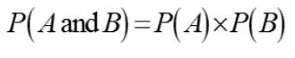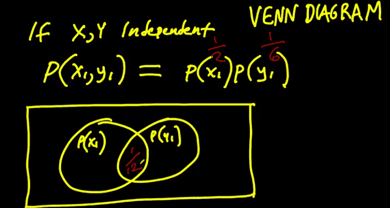

## O probabilidad

Es la probabilidad de que ocurra un suceso, o el otro, o ambos. Si sumáramos las dos distribuciones (círculos),contaríamos el área central dos veces, ya que ese rango de áreas de valores en la distribución ocurren en ambas, por esta razón, esta probabilidad es P(A) + P(B) - P(AnB)

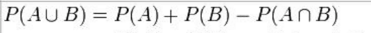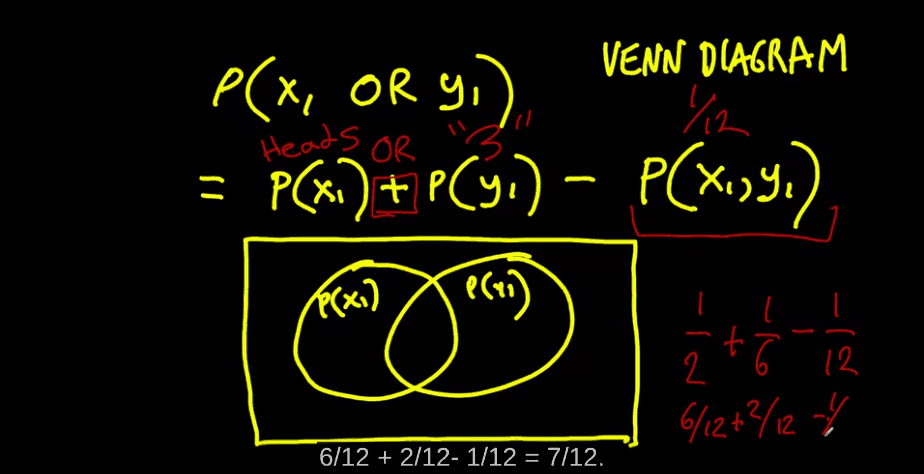

## Dependiente Probabilidad conjunta (probabilidad condicional)

Consideremos que A y B no son independientes porque si se produce A, la probabilidad de que se produzca B es mayor. Cuando A y B no son independientes, suele ser útil calcular la probabilidad condicional, P (A|B), que es la probabilidad de A dado que haya ocurrido B, en este escenario la probabilidad de que A conozca a B es la misma que la parte de la probabilidad de que ocurran ambas que no corresponde a la probabilidad de que b ocurra independientemente,

P(A|B) = P(A ∩ B)/ P(B)

La probabilidad de que ocurran ambas cosas es la probabilidad de que ocurra la primera, y luego ocurra la segunda sabiendo o dado que ocurrió la primera.

P(A ∩ B)= P(B) \* P(A|B)

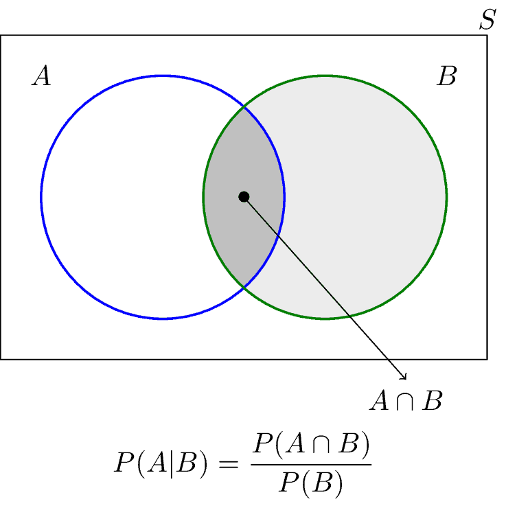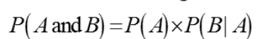

## Teorema de Bayes:

Sabemos que la probabilidad de P(AnB) es la misma que la de P(BnA), y sabemos respectivamente que cada una es igual a P(B) \* P(A/B) y P(A) \* P(B/A) , podemos utilizar esta información para calcular la probabilidad de cualquier individuo, A o B combinándolas en una fórmula según nos convenga.

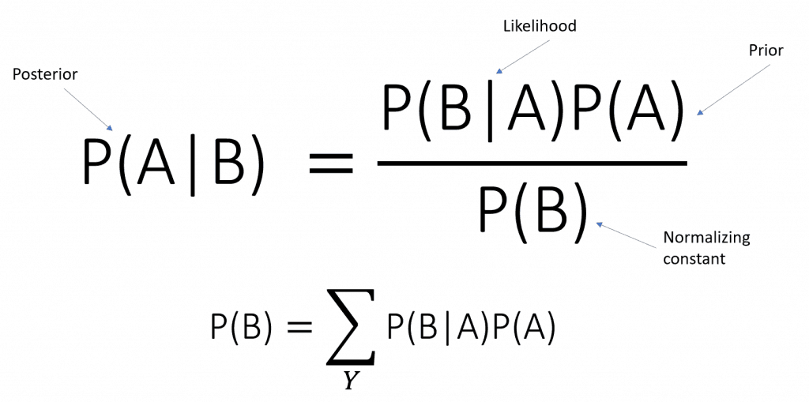

Además, la probabilidad de cualquier variable individual es la probabilidad de que esa variable ocurra, sabiendo que la otra variable ocurrió, más la probabilidad de que la variable ocurrió sabiendo que la otra variable no ocurrió. Básicamente, sea cual sea el escenario, tenemos en cuenta las posibilidades de que haya ocurrido A.

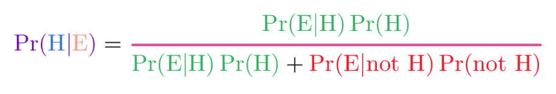

## Permutaciones

### Permutación donde n está formado por elementos únicos y permitimos la repetición de esos elementos al crear grupos

los grupos de n elementos pueden tener cada uno de los elementos posibles más de una vez, cada vez con un grupo diferente. La probabilidad es n^m

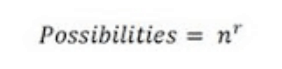

### Permutación donde n está formado por elementos repetidos

Cuando tenemos n elementos, pero sólo menos de n elementos diferentes.  
Probabilidad de que determinados sucesos ocurran en un orden determinado, aquí el orden importa mucho. Específicamente, n eventos que suceden ordenados en grupos de m elementos, donde cada cambio en el orden aunque incluya el mismo elemento, se considera un nuevo grupo.

colocando 5 elementos en grupos de 3, es la probabilidad de que ocurra cada uno de los posibles elementos colocados en un grupo de m números, ¡n factorial! / n-mfactorial!, con ese denominador nos aseguramos de excluir el número de elementos que no formarán el grupo en nuestro cálculo de probabilidades.

Por lo tanto, nuestro resultado sería ¡5!/(5-3)!= _54321_/_21 = 54\*3_\= 60

Normalmente, la probabilidad de colocar n elementos en distintos órdenes no es otra cosa que la probabilidad de que cada elemento sea elegido, una sola vez. Si no se permiten repeticiones, la probabilidad de ser colocado se reduce cada vez que se coloca un elemento.

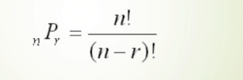

### Permutaciones con repetición:

En este caso, calcularíamos las posibilidades de la misma manera pero, además, dividiríamos por el factorial del número de veces que se repite cada elemento

Imagina que tenemos la palabra definición, ¿cuántas palabras de 5 letras podemos crear con sus letras? ¡Haríamos el factorial de 10! / por el factorial de (10-5) + el factorial de 2 ( la letra n se repite dos veces) y el factorial de 3 ( la letra n, tres veces). Hacemos esto porque en realidad, tener una letra repetida aquí, disminuye las posibilidades de nuevos grupos, incluso si tenemos en cuenta el orden

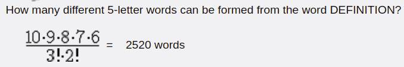

## Combinaciones:

Cuántos grupos se pueden crear para n elementos distribuidos en grupos de m. Aquí el orden no importa, y en este caso, obviamente, las probabilidades son menores que en las permutaciones.

Básicamente igual que antes, usamos el factorial de todos los valores posibles, pero ahora, los diferentes órdenes tienen el mismo efecto que las repeticiones, así que tenemos que quitarlos.

¡Factorial de n! ¡/ factorial de (n-k)! (Igual que antes) ¡pero ahora también veces factorial de k! ( ya que k representa la redundancia)

