Today I'm going to perform a real data analysis case with Power BI. The idea of these posts is to serve as an accelerator tutorial showing in a didactical, fast and effective manner the most important aspects and knowledge needed to work effectively in power BI.

We are going to work with a real dataset, that you can download from here.

## Basics:

### How to get the best of powerBi

If you check the powerBI website, you will notice there are basically two products, the desktop version of powerBI and the Cloud, sas version. One of the sad things about microsoft products, is that user experience usually sucks could use some refining. In powerBI this translates to a HUGE difference, between the two products. To the point, that to actually get the best from powerBI you will need to use both. It's a pain, but that's what we get for using dashboarding tools for almost no cost.

Essentially, desktop powerBI is for data modeling, there is a bigger quantity and quality of resources in the desktop that you just don't have online when creating graphs. The SAS version, on the other hand, is designed to help you share your content created in desktop, with dashboards and other tools. You can't create dashboards in desktop.

So a good powerBI process usually requires of us to create the graphs and models in desktop, group them into dashboards later in the cloud.

If you don't believe me, here are some links for you to check out. [Here](https://community.powerbi.com/t5/Desktop/BI-web-vs-desktop/td-p/3736) and [here](https://www.mssqltips.com/sqlservertip/4139/compare-power-bi-desktop-vs-power-bi-online/). Because of this, this tutorial will teach and touch both tools. That´s the true, sad way to master PowerBI :( .

### How to load data in cloud:

The first method is by uploading a CSV/ excel file directly. To do so, you need to go to the home tab, go to the workspace you want to load it to. From there, click on "create" and finally "dataset". It will give you options to upload the dataset, choose to pick the file from local, and ta-da! you just have to pick it now. Afterward, you can go to the data set or click "view dataset" to check the data.

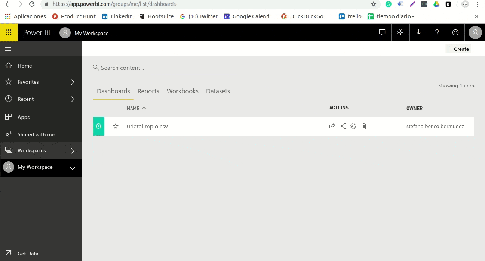

Once data is loaded on the cloud, we can work with it too in our desktop. We just have to download powerBI, install it and sign in with our cloud account. After that the user interface will appear, and we will be able to get the data by clicking "get data" and then choosing "powerBI datasets".

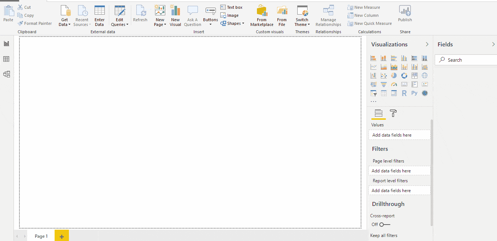

### Basic understanding of the Power BI user interface (cloud):

When we open a dataset, a screen like this one appears. Here is where we are able to create graphs and do fun stuff.

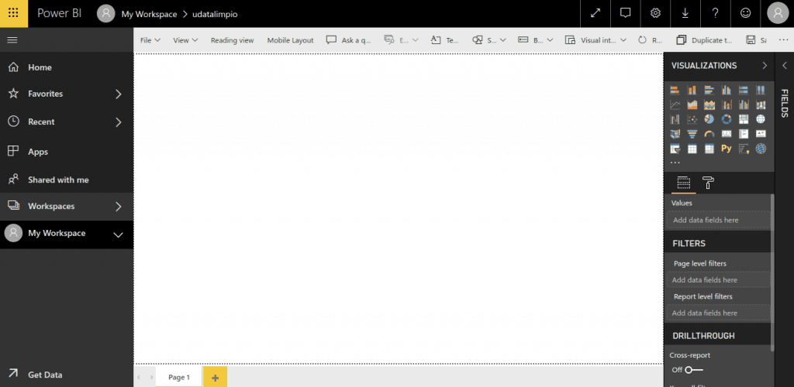

We have at the top of the screen the main menu where we can modify aesthetics, format, and insert external (not graphs) figures to our screen. It works in a very similar way as any microsoft office product does.

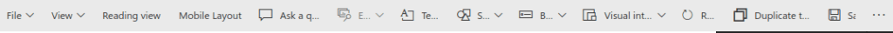

On the foot of the screen, we will see tabs, just like excel allowing to separate our created graphs in different pages.

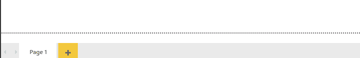

At the left, we can move inside our powerBI account, and at the right is where the magic happens, the place where we will specify and configure graphs, filters, formulas, and all that party.

### Data loading in PowerBI desktop

We have seen how to upload data into powerBI cloud, in the case you had to do the dashboarding there for somereason, instead of doing it on desktop. The process is slightly different on desktop, so I'm going to walk you through it.

If you have been a proactive boy, you already downloaded the dataset for this case, that you have here, and have it stored in your computer. You also already have installed the desktop version of powerbi.

To upload it, click on the "obtain data" button, and choose your source. You need to make sure that data is cleaned before uploading, no matter the source you choose. There are some data cleaning possibilities in powerBI, but they are focused specially on changing variable and column types, complex formatting like string replacement, etc should be done outside of it for efficiency.

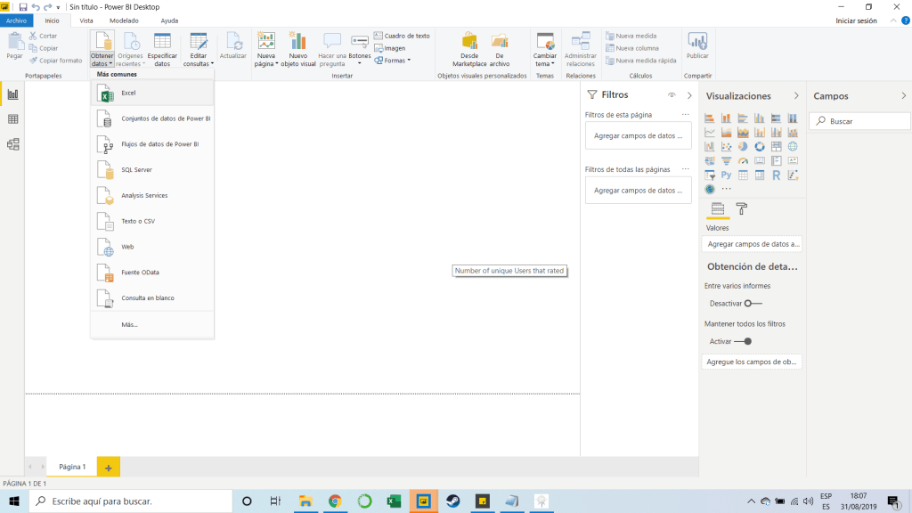

After loading the data, a curious screen will appear, for some reason, it seems our sheets have been doubled? This means that powerBI allows you to import the sheet itself, or the table that it contains.

If you import from a worksheet, you get all data on that worksheet.If you import from a table, you get the contents of that table, even if there is other data somewhere else on the same worksheet. As you can have multiple tables on 1 worksheet, the cleaniest solution, would be to choose the data as tables to upload to powerBi.

So we have the data, now it's time to understand our playground.

#### Changing the language to english

This might be a silly step, but it is important that you have the language in english, that way you will be able to use other people's code easier.

Go to files---> prefferences/settings---> settings.

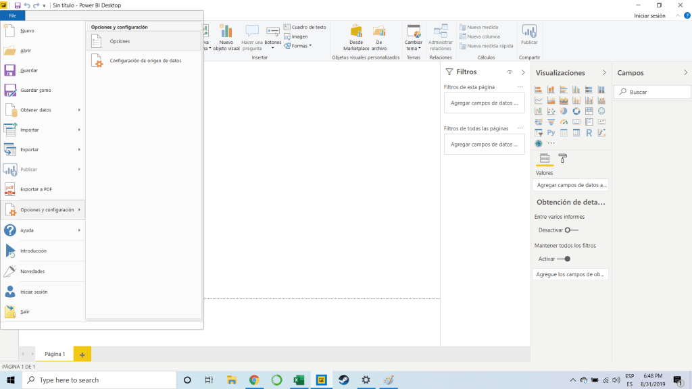

Go to regional settings, and change everything to english. In this examples I'm changing the language from a spanish implementation.

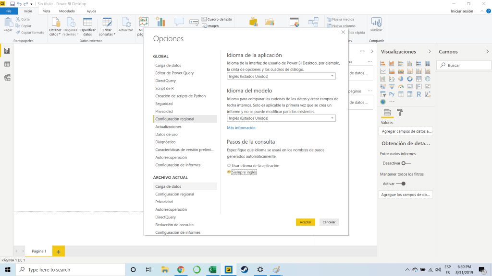

#### Understanding the layout in desktop

Although very similar, powerBI desktop's user interface has slight but significant small differences.

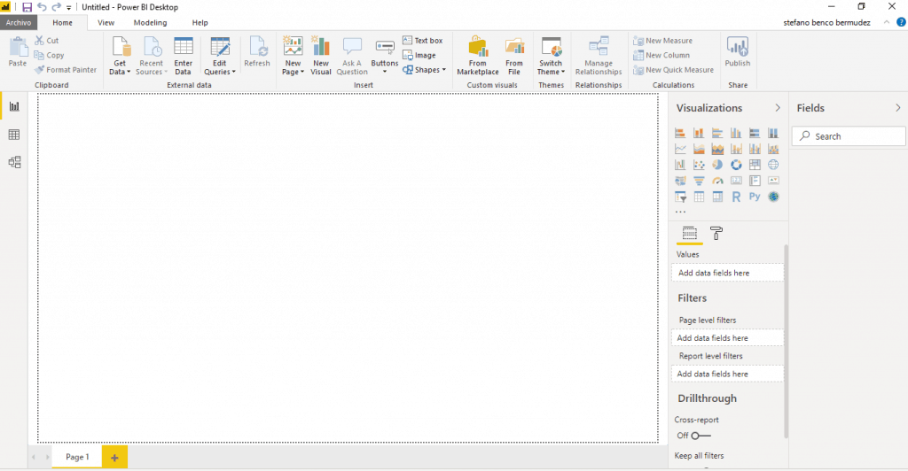

On one hand, we see the top menu has a different presentation of the features and powers available, you will notice eventually that there are more options here on desktop. This is also true with the right menu.

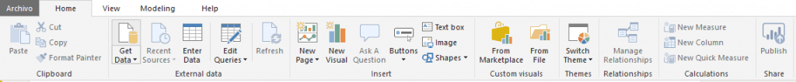

The left menu instead of allowing navigation of our account, here represents a menu where we can see the data we are working with in different manner. Here we can see data either as the graphs, as the actual table format that we uploaded, or as relational database. We will see the usefulness of all this later.

<figure>

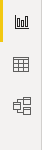

<figcaption>

  

</figcaption>

</figure>

Ok, cool for the moment, let´s get to the basics of graph creation:

## Graphs creation basics:

1) Once you have the data loaded, you can see it on the right , by choosing any of the column' s of the data you loaded and drag and drop it on the canvas, a graph will automatically be created. PowerBI chooses a basic graph for you everytime you first drop, the one that for him, or rather it (powerBI uses machine learning algorithms) makes more sense. For example, if we drag the column rating, it will automatically create a barplot.

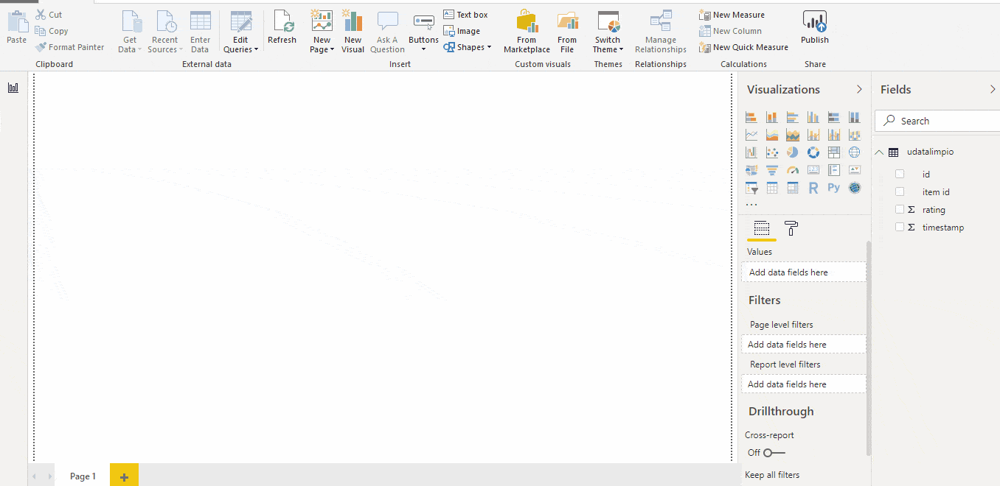

Notice that by click in the window corners of the graph, you can change it's size.

2) From here it's all about modifying this graph , to do that that we wanted. If we drag on top of it another column of data, the graph will automatically change because it will be storing an extra data column, therefore changing the appearance of the graph. PowerBI guessing from here on out will not be as effective so we need to know how to choose the graphs we want. You see this visualisation options right?

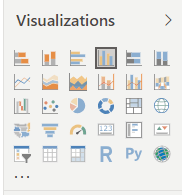

Well that is the place where you choose the type of graph you want to work this. Let's try all this cool stuff out by adding to our barplot the item id, and changing from column chart to a treemap.

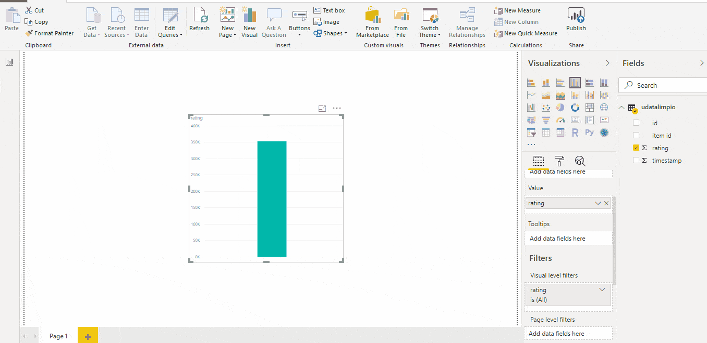

This treemap allows us to see the item' s id separated by how big their calculated value is.

That takes us to our next point:

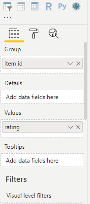

3) How do we modify the calculation done to generate values? And how do we choose what data goes on the X and Y axis? That piece of the magic happens right below our visualizations options. Over here

If you click on the downward arrow you will be able to choose the method of calculation, (SUM, AVRGE, COUNT....) if you scroll down on the bar, you will find the X and Y axis. You can change what goes inside either by clicking or by drag and dropp. If all this sounds to weird, just check the following gif.

We are going to alternatate between x and Y axis, and change the value of rating to AVG.

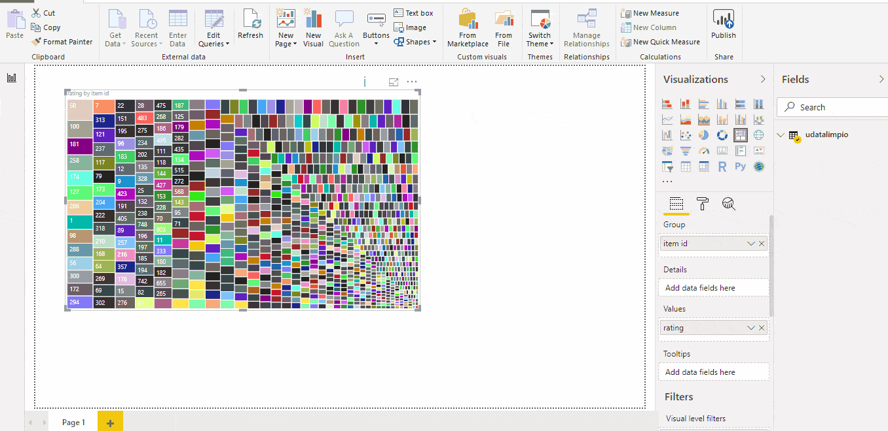

Note: Depending of the graph, Axis will be named group/values, or other. It' s the same idea.

For our first sheet, lets try this, we want to analyze the distribution of all ratings. To do this we will plot a density bar plot. Lets move to the Axis, rating, and change the value to count of ratings. Let's click on "show value as" % of the <grand total.

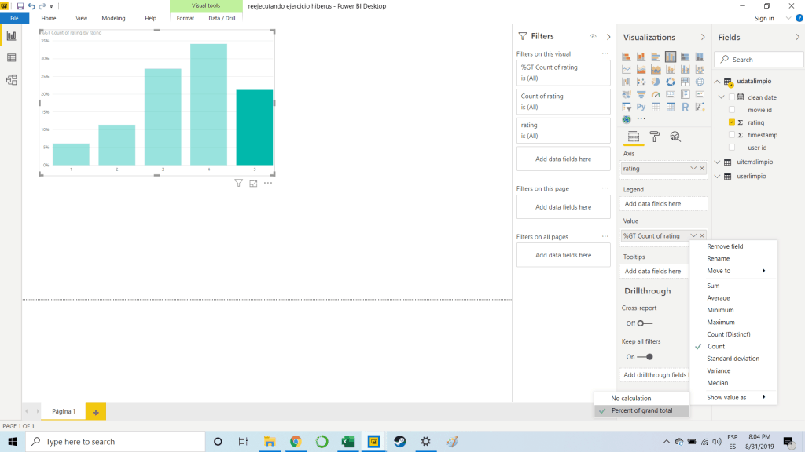

## Graph analysis basics

#### Managing relationships between graphs

Now, get your pants ready, because if this is the first time you are using PowerBI and any business intelligence tool, I'm going to blow your mind. Let's do the same graph we just created analyzing the density of possible rating values, and place the "occupation" column from user graph, to the canvas. One again click add the same column as both the axis and the value, choosing count as the measure. You will now have this graph.

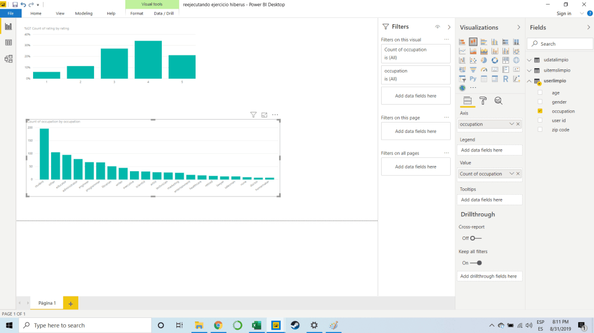

Here is the cool part, if you click any of the bars in theOccupation distribution chart, it will use your click as an automatic filter for the ratings chart. This is the power behing business intelligence tools, all charts can serve as dynamic filters to the rest of the charts in the canvas.

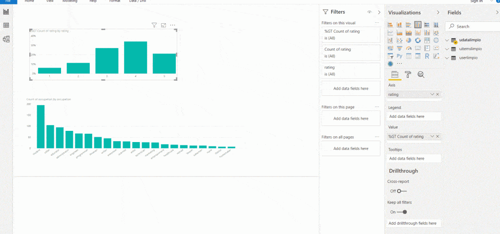

Now here is where the "advanced user" part of this post comes, if you notice, by default if you click on any rating bars, the occupation bar will not be affected. Why is this?

The reason behing this, is because the calculation shown inside the rating chart is not based on data of one of our columns, but rather the inmediate calculation of what happens in ratings. This does not have a clear effect on occupation distribution and so it can't serve as filter.

In this excersise we will play a litle bit with this chart later, let's leave it at that for the moment.

#### Power query Editor

Ok, so now it's time to start looking at the possibilities. The first thing to see is the power query editor, this is the place where we will make use of formulas, clean and transform the tables, and all operations related to data.

We can enter by clicking in "Edit queries" in the Home tab

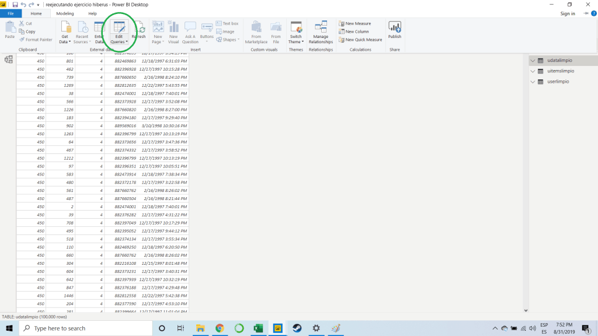

The first thing we should do is checking that all the columns in the different tables have the correspondent data type. You can change the data type of each column by clicking the icon next to the column name.

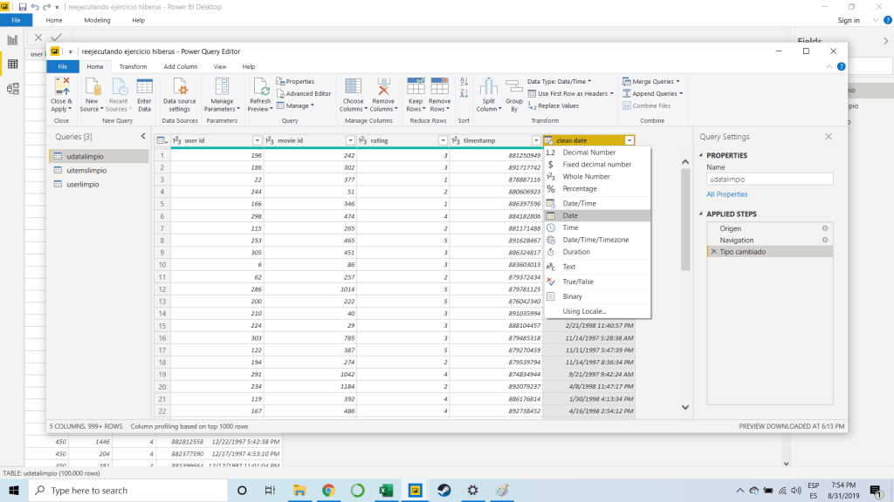

#### Dax, Measures, quick measures and Custom columns.

Custom measures can only use measures as part of their formulas.

Measures allow to create calculations that will dinamically be changed based on the dynamic filtering we cause when we click. Collums will create new data for each row of a particular table, this means that the data itself will not be dinamically filtered.

The main difference between columns and measures is the filter and row context. Measures do not have row context in their calculation, but columns do.

When creating custom measures, remember we can only reference other measures inside the formula, we can't reference naked ( function-less( columns, because the meausres don't have "row context" they make an aggreagation of all rows, but they don't do it in a specific order. This means, a calculated measure can't have for example \[benefit = income\_collumn - cost\_collum\]. For example, if we tried to do udata\[movie id\] - udata\[rating\] it would give error, we simply are not able to write naked columns( without applied function) on measures. We would have to have benefit = income\_measure - count\_measure , if they are measures, then they include aggregated data so they work effectively.

If you need to have a calculation in each row, use a calculated column instead of the measure.

Let's do some examples:

#### Custom measure example

That's the row context, the filter context is the information that entity has of all the related data. Basically, how well will it adapt to dynamic filtering.

Let's get deeper into our rating analysis, and create the "rating count" variable.

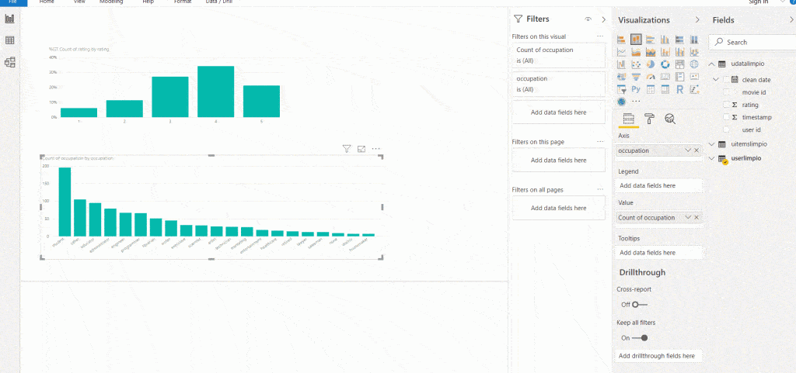

Now in our occupation distribution, let's change the value from occupation GT count, to our new created variable. Now we see both charts can filter each other, because their value variables are connected.

So, let's make a small stop here and establish some requisites needed for our charts to effectively filter each other:

\-The values of the charts need to affect each other.

\-The effect one has over the other needs to be formally written in Dax language) This is important.

When creating custom measures, remember we can only reference other measures inside the formula, we can't reference more than one column at the same time, because the meausures don't have "row context" they make an aggreagation of all rows, but they don't do it in a specific order. This means, a calculated measure can't have for example \[benefit = income - cost\]. For example, if we tried to do udata\[movie id\] - udata\[rating\] it would give error, we simply are not able to write naked columns( without applied function) on measures.

#### Using slicers

What's a slicer? It's a type of graph that, esentially serves as a dinamical filtering tool. It can be presented as an actual slicer, or just a filter. PowerBI automatically decides the best form it should be used with depending of the type of variable. Let's try it out, from users table, lets create a slicer for gender and age, to see the difference.

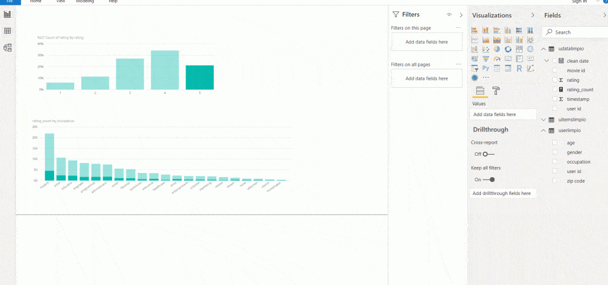

#### Some a litle bit more complex excersices;

#### Creating a distribution for a number of categorical binary variables.

For example, if we want to represent the distribution of movies not mutually exclusive, representing each category. In our dataset we see that each movie category is a binary variable, we don't have one column with many possible categories, but rather many columns, just establishing 1 or 0 for that category, allowing for a movie to be part of two simultaneusly. In this case we would have to create a custom measure for each and everyone of the variables, where we count the number of '1' in all their rows, and then plot all those measures in a graph against each other.

Let's create one, for example, using action , in this case, we start with the calculate function, because we are not going to count and that's it, we need to count using a specific criteria, selecting those rows where action = 1 .

We do that with all the variables, allowing us to finally plot something like this.

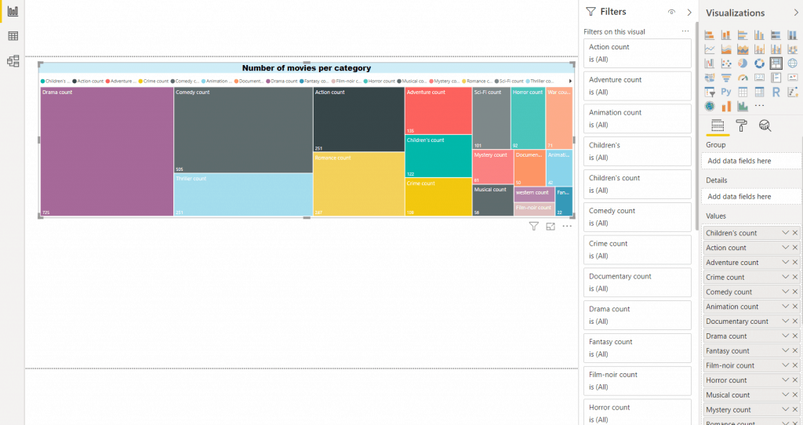

#### Creating a rank:

We create a measure establishing the criteria we want to rank for, then we use the RANKX function to create a measure called rank, where we specify the column we want to use and the measure we want to make the ranking.

For example, let's try creating a rank measure for count of ratings and rank movies by the number of ratings they have. We are going to use RANKX(ALL(uitemslimpio\[movie title\] , \[rating\_count\]) , we use ALL because we want to make sure that when applying the measure it calculates based on all the rows in the table, ignoring the filters.

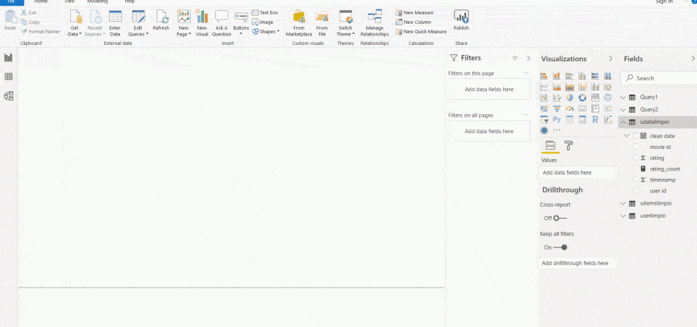

In case we want to hide a number of ranks, showing only a specific number of them, we create a filter that allows us to establish and specify a number. This filter is called a Parameter, in powerBi . And create a new ranking with an if clause, making sure that the ranks under the specific filter are hidden. Let's try it out , let's first create the parameter

To do this, go to modelling and click " create new parameter" . Like this:

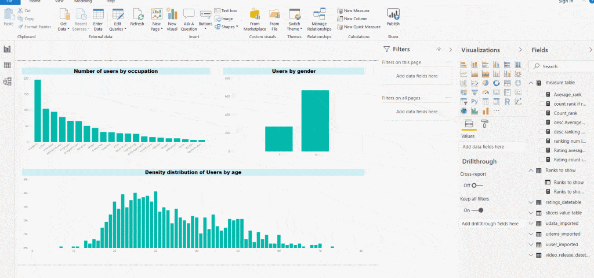

Now, we create a new measure that essentially will compare the normal measure with the parameter, only showing a number if the rank is bigger than it. To do this, we use the if function for example:

Ranking\_count\_if\_parameter = IF(\[Count\_rank\] <= \['Ranks to show Value'\] , \[Count\_rank\] , BLANK() ) . Basically, if count rank is equal or smaller than ranks to show, (that means it's on top 5) then show count rank, if not, show blank. THis will cause that now, the ranking count column looks empty on larger ranks.

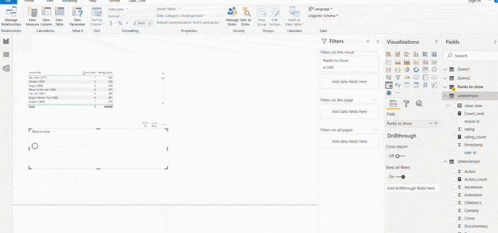

If you wanted to make other columns, like movie title or etc be part of the table, but also disappear if they are not part of the rank, you would have to create new if filters to them.

And that's it! A good start to powerBI. Hoped it helped.
