This post is intended to serve as a step by step guide-refresher, to be used when designing low-level machine learning algorithms. Most of them refer to creating matrixes and vectors for the operations inside them, on a manual manner, not utilizing high-level packages like keras or scikit-learn, but rather, low-level ones like tensorflow or pure numpy. Here we are going to re-read notes on matrix multiplication and linear algebra.

## Remembering the linear algebra

### Vectors

Vectors are 1-dimensional arrays of numbers or terms. Basically, we can think of them as a one-dimensional list of values. As such, they can be represented in a plane, as changes that can happen to points. Vectors store the magnitude and direction of a potential change to a point. The vector \[5, -2\] says "go right 3 and down 2" in a plane, this only can be understood as such in a two-dimensional plane, for this particular vector, only being graphically presentable in two dimensions. Consequently, a vector \[3,-2, 5\] could only be represented as a potential change to a point in a three-dimensional plane.

As a list of coordinates that also represent a change, we represent the effect of the change the vector has with an arrow. The non-tip end of the arrow represents theoretically, the initial state of a coordinate, and The tip of the arrow represents the final state of a coordinate after you added to that coordinate that particular vector. To represent graphically, the essence of how a vector affects the plane in which it resides, we use the origin coordinate as the non tip end of the arrow. But in truth, it can be used anywhere on the plane. A vector \[2,5\] can be seen like this

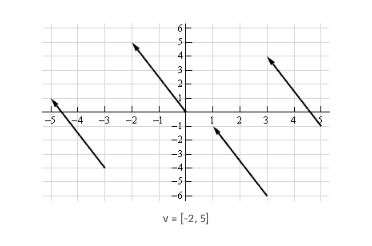

Consequently, a vector A = \[2,1, 3\] could only be represented as a potential change to a point in a three-dimensional plane.

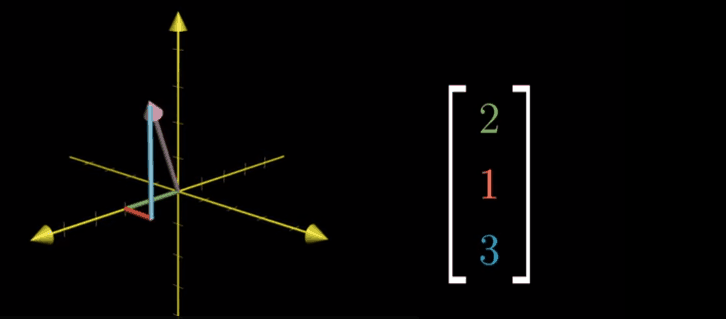

When we represent just one independent vector, the vector can be seen as a free vector. There are two different situations possible when we represent a vector graphically, that the vector is fixed or free.

A vector can be represented as a free vector, when it is specified as an array of values that can be placed anywhere ( we are interested in them as theoretic elements of change) , they are fixed when they are determined be two or more arrays of coordinates, the fixed vectors is that force that connected the other two vectors.

Let's look at the following image,we have three vectors A, B, and V. A and B can be seen as free independent vectors, connected to the origin, as we just represented before but V is a fixed vector, that represents a mathematical force that can cause any reality in vector A to end in Vector B.

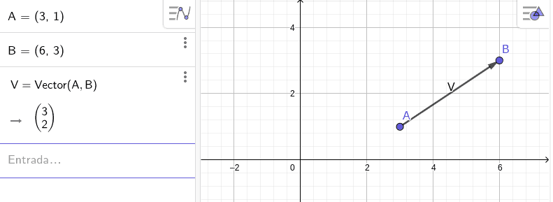

No matter what happens, V will theoretically always represent what happens if a coordenate A you add the Coordinate V, spoiler alert: It will cause A to become or move to B. This is the reason why it is called fixed.

Free vectors are represented from the origin( or anywhere) to their coordinate. Fixed vectors are represented from a particular coordenate to another specific coordinate and can only be represented there to maintain it's scientifical usefulness.

For example, here, B is a free vector, defined by the array \[1.75,1.74\] while V is a fixed vector, defined by the coordinates \[1.9,0.34\] of the free vector A and \[1.49,3.86\] from vector C

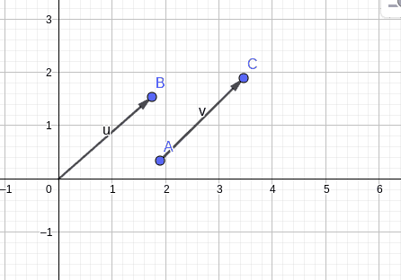

Formally, they can be presented in these different forms, but they all represent the same.

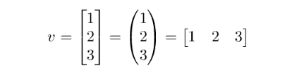

Of course, vectors can be operated on, as objects designed to store numerical information, and possible mathematical forces, we can operate on them to combine them or be affected by other vectors or by simple numbers (scalars).

### Vector Operations

### Vector with scalar

Adding, multiplying, dividing or subtracting a scalar to a vector, means executing that operation on each element of the vector individually.

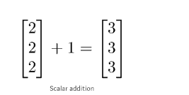

Graphically, this Corresponds basically, expanding the effect the movement of the vector has, by adding /multiplying/dividing, the value of the scalar to itself.

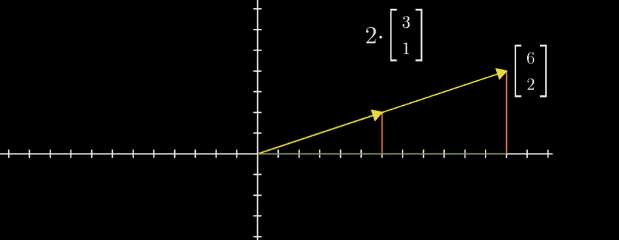

When we multiply a vector to a scalar, This is so because vector X scalar is just the vector in the same direction but in other coordinates.

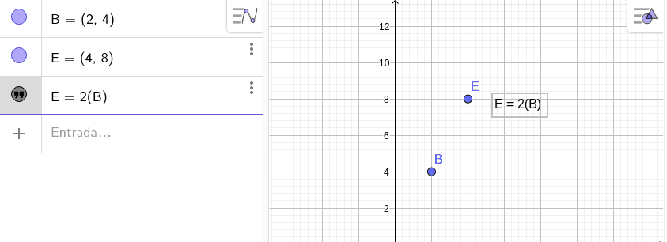

A vector + Scalar, on the other hand will cause a change in both the coordinates, and the direction of the line or function that could cross it if you compare it to the origin, or to any other point

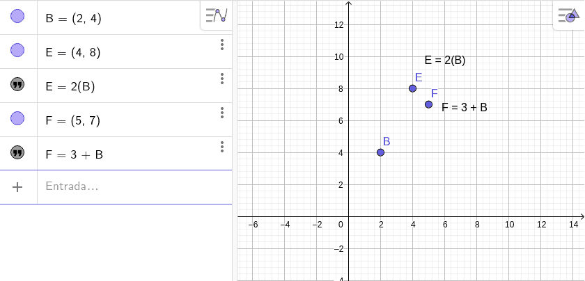

### Vector with vector

On the other hand, adding, multiplying, dividing or subtracting a vector to a vector, means executing the operation on their equivalent positioned parameters

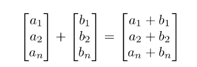

If we remember, vectors are forces inside dimensional planes, where each of the elements represents a value for each of the dimensions of said plain (this is the reason why a two-valued vector, can only be graphically represented in two dimensional graphs/planes) , basically operations between vectors cause for the vectors corresponding values for each dimension, affect their counterparts on the second vector.

Vector element-wise addition, is equivalent to moving in the direction of the vector inside a plane, and then, moving in the direction of the second vector. Basically, like moving in the direction dimension( vector 1dimension1 + vector 2 dimension1 ) and then vector1 dimension 2 + vector 2 dimension 2).

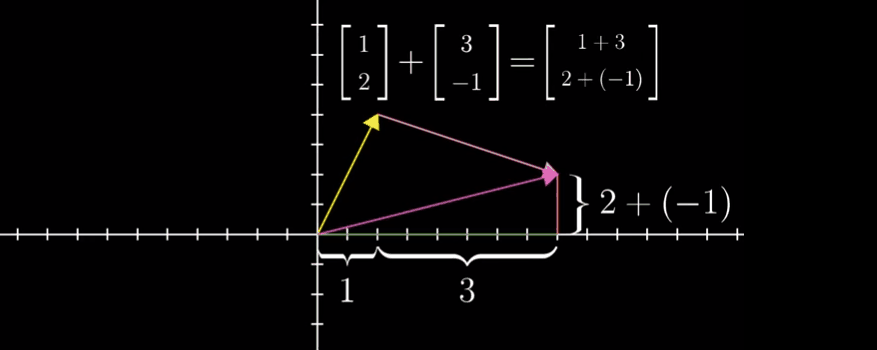

The same principle of change can be applied with element-wise multiplication, division, subtraction etc.

The vector also has another possible way to multiply each other, the dot product, that reduces all the information condensed in both lists of values, into one unique number

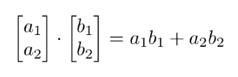

The dot product is a value expressing the angular relationship between two vectors.  
A dot product is a scalar value that is the result of an operation of two vectors with the same number of components. Given two vectors A and B each with n components, the dot product is calculated as:

A · B = A1B1 + … + AnBn

The dot product is thus the sum of the products of each component of the two vectors.

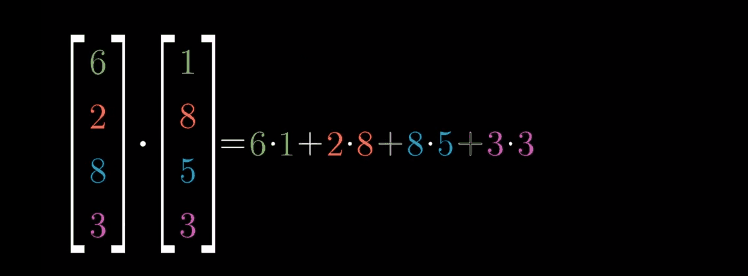

It's equivalent to projecting one vector onto the other, multiplying the length of the projected vector, with the length of the vector that it's projected into.

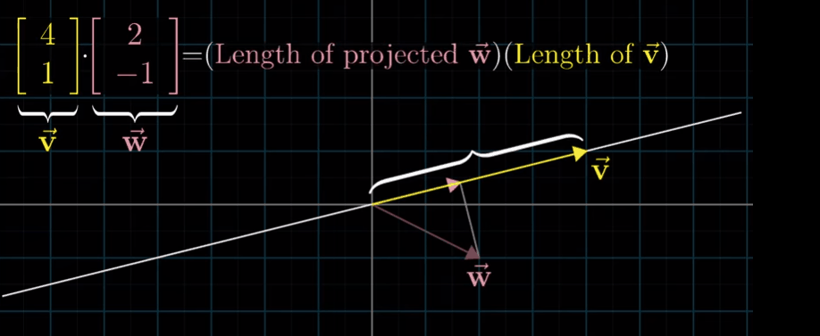

## Matrixes

Matrixes are a different form of grouping information that organizes values in a two-dimensional object, you could consider them a cluster of vectors, organized in groups. A grid of values (more than one list) organized in categories/attributes/groups/classes or whatever separation criterion you could think of. The two dimensions are rows and columns.

In the sense of data and value organizations, matrix essentially represents vectors ( either the rows or columns can be seen as vectors ) grouped or categorized in columns or rows.

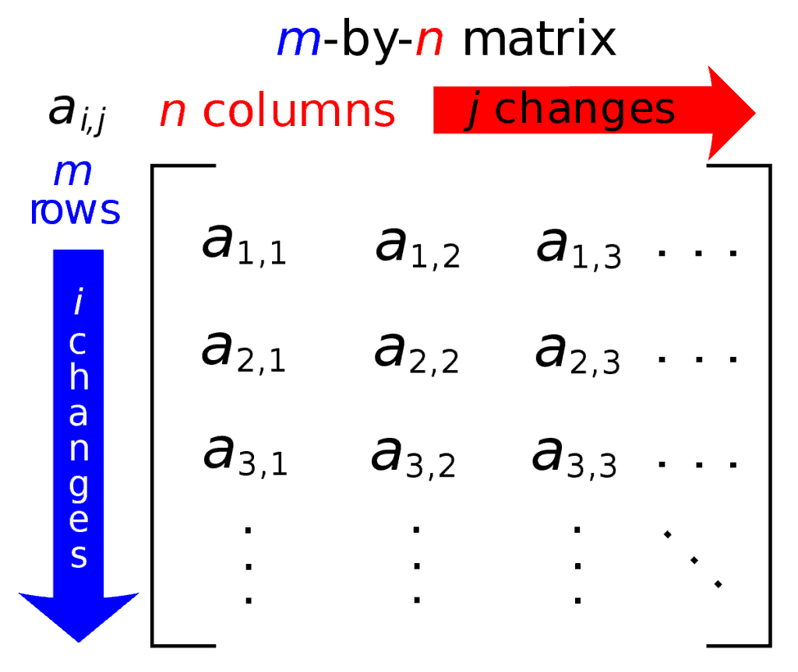

Because of this two dimensional definition, you could say that actually, we have the potential to organize values based on two classification criterion, one regarding what it means for values to be in separate rows, and one for values to be in separate columns. Basically, not only do we have many vectors now, we have a mean to differentiate them.

Conventionally, in data analysis, we use the rows to represent each of the samples of our data, each interaction of data gathering, and the columns are used to represent each one a variable of the study, a variable whose data we gathered in each interaction. Mathematically, this will correspond to a dimension in a plane.

In this way, if we had in vectors that each value was correspondent to a dimension/variable in a n-dimensional plane, in a matrix each column represents a correspondent dimension/variable and each row, a list of values each with a sample value of said dimensions.

Because of this fundamental difference, in the way matrix serve to store information , they can't be represented in a graph the same way vectors are, matrix, therefore, don't signify potential changes to a point, but rather, are just an organization of different points corresponding to different variables that are potentially related to each other. A matrix is a synonym to just, points in a graph. A matrix of nrows, and three columns could be represented in a three-dimensional plane. Like this one :

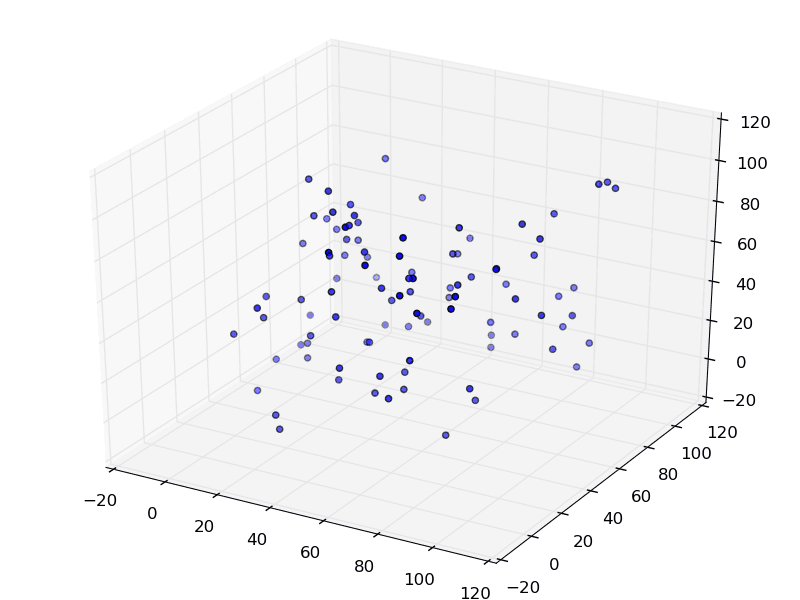

Here, the rows would represent the number of values for each dimension, and the columns, the dimensions themselves. This would mean that each and every one of the rows ( with one value for each column) represents a point in the graph. On consequence, a matrix, of n rows, and 2 two columns, would be represented like this.

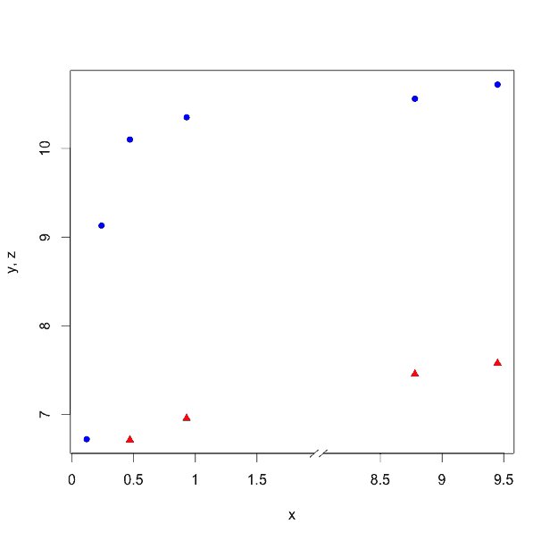

## Matrix operations

Matrixes of course as data storing units can be affected and operated upon. Just like vectors, and scalars, and any mathematical representation of reality. And this is very important because, computationally, they represent the fastest object to which computers can operate on.

### Matrix per scalar operations

We can add, multiply, divide and subtract scalars the same way we did with vectors, we execute the operation with each element individually, resulting in a new matrix of the same dimensions as the previous one.

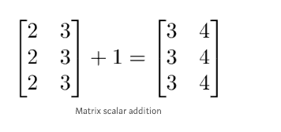

### Matrix per matrix operations

Matrixes, can also be added, subtracted divided and multiplied with other matrixes, in an element-wise fashion, we have to remember that at the end of the day, matrixes are classifying values in different variables and groups, usually the columns represent the variables, and the rows represent groups related to the interaction of the data gathering, though they could mean other things ( the rows could mean one type of classification and the columns a different type of classification) , or even, columns could be interactions and rows could be variables. Whatever the case, elementwise operations between matrixes are possible, but can only happen between matrixes with the same dimensions.

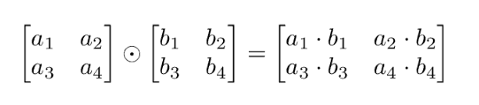

### Matrix per matrix dot product

Matrixes also allow realizing dot product multiplication, allowing to synthesize the information of both matrixes in a single object. This allows also to multiply matrixes that don't have the same dimensions. There are some rules though to this process:

1)The number of columns of the 1st matrix must equal the number of rows of the 2nd.  
2)The product of an M x N matrix and an N x K matrix is an M x K matrix. The new matrix takes the rows of the 1st and columns of the 2nd

We execute the operation, where each element of each row, read from the top to the bottom (the first row is the top row, and the last row is the bottom row ) is multiplied by each element from each column read from left to right (the first column is further left, and the last column is further to the right)

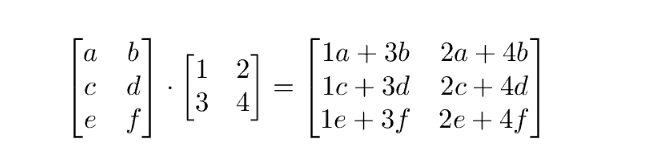

### Vector \* Matrix dot product

If matrixes are simply, are groups of lists containing different values, where said values correspond to different dimensions, ( points in a graph) and a vector, is a list of values (that corresponds to the graphical representation of potential effects and changes, that can affect each and every point, inside a graph, aka, each list of values in a matrix ). Matrixes, with vectors, represent functions.

f(x) = 236 x + 456 y + 376 z, this mathematically means that x , y and z affect the f(x) by multiplying 236 to the x values, 456 to the y and 376 to the z. In other words

F(x) will be a matrix, representing all the list of values we can come up or gather for x,y,z multiplied by a vector \[236,456,376\]

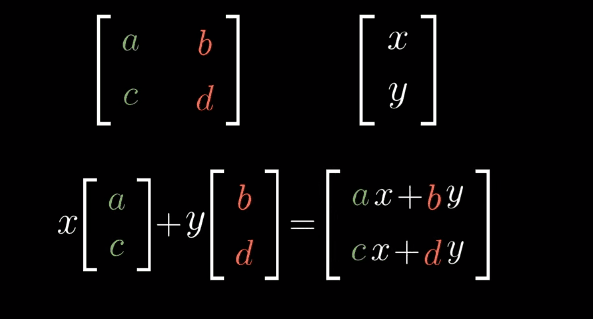

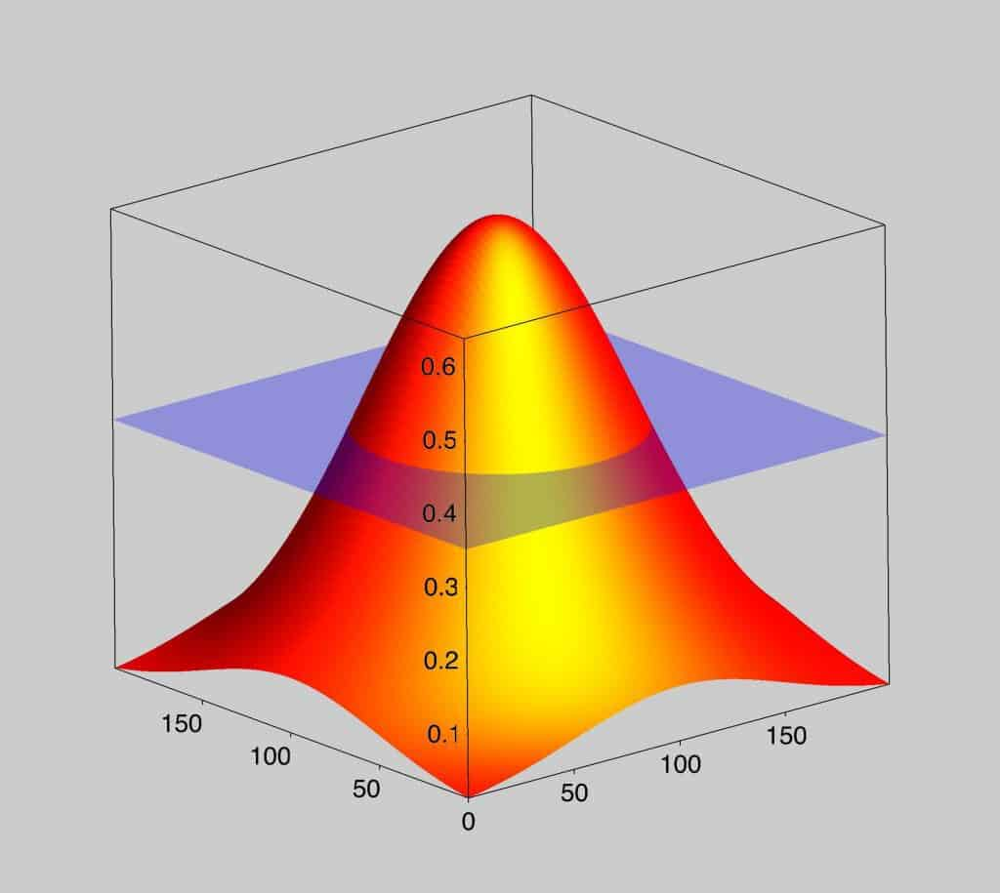

A matrix \* a vector, represents essentially a function.

Now you know the basic gist of linear algebra, I will be sharing soon a githbub jupyter notebook were you can run some example code of matrix and vector operations .
