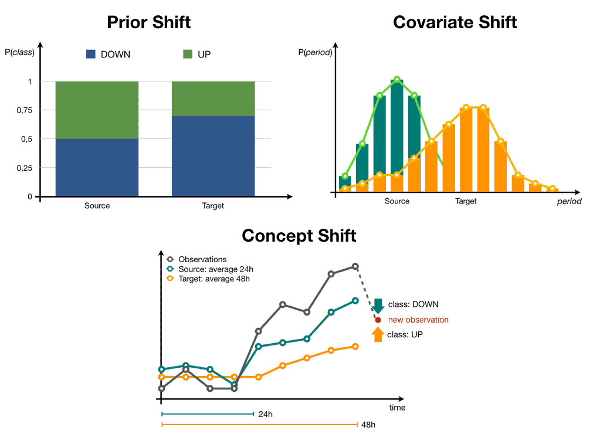
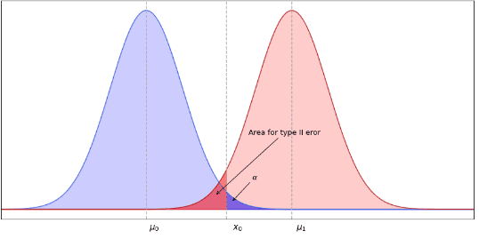
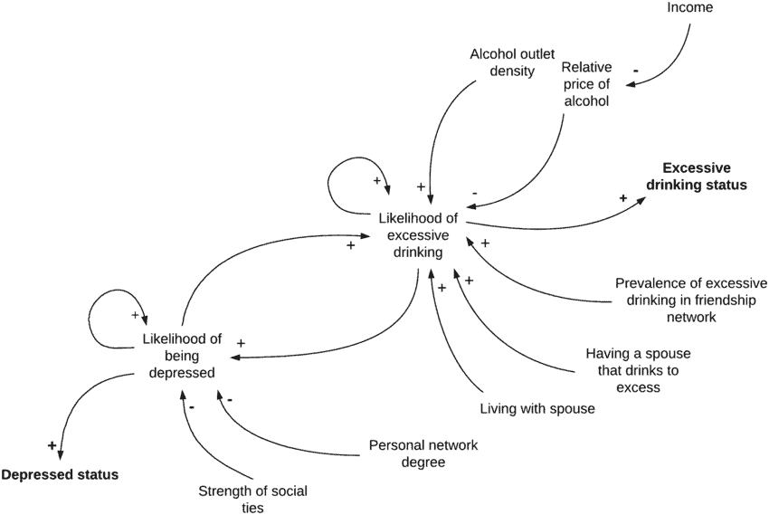

# Hypothesis testing  as a  key mathematical tool for data-driven strategy

Hi! Welcome to this article! This is my first time writing for Medium in what, I hope,  will become a hobby in which I’ll indulge more often. 

I’m not a professional writer but I believe I’m very passionate about the topic that interests me. Learning and teaching people just enough math to be able to apply it to their businesses. As a businessman that later became a data scientist, I get a rush every time I learn something with which one can obtain competitive unfair advantages.

I hope you find my ramblings useful and If you don’t, I’m completely open to feedback!. Don’t kick my ass too hard, I’m open to feedback, not feetback\*.( I wrote that line just so I could say that terrible joke).

Today’s topic revolves around what I believe is one of the key skills any data scientist or mathematical engineer should have when focusing their talents for industry purposes, and a key element in data-driven strategy.

 In case you have ignored the title, and somehow like to read random posts without checking their titles first, I’m referring to hypothesis testing and demonstration.  In this post, before actually getting geeky and explaining mathematically how it works, I’ll try to convince you of why this tool is central for business strategy and give you an idea of how it works. 

Why is it so important? 

<figure>

<figcaption>

_I took that picture of the flower with my camera, I also take cool pictures! :D_

</figcaption>

</figure>

## Reason 1: To reduce risk in decision making

Well, this one is easy to answer, you probably noticed how the term “data-driven” has become increasingly popular recently. It’s popularity is not misplaced, there has been a total paradigm shift in the way business strategy and entrepreneurship is being done and decided during the last 20 years (basically because the first guys to do it took the world by storm, and have now become technological kings with very sharp FAANGS), and the key to their success is that strategy is now based on data. 

Now decisions are made not only based on gut instinct, charismatic leadership, and trust in heuristic market analysis based on experience, but also with knowledge on par with the scientific fact that those leaders are, probably right with a certain degree of confidence in the ideas they bet on.

You can imagine the differences in success between a company that makes a decision and they kind of think they are right, but are not really sure, and the ones that make them with a good background of experiments and tests that indicate they are probably right with 95% of confidence. 

Survival of the fittest said Darwin, and at the core of being fit in today’s business jungle is a data-driven strategy. There is no data-driven strategy, if we can’t demonstrate or at least reduce the likelihood of the assumptions on which those decisions are based, being wrong. **Hypothesis testing, as its name implies, helps exactly with this**. 

Theoretically, any decision a business faces (that has direct implications on the success or failure of that company in the competitive market) is based on a hypothesis(beliefs) of how that market or situation works, making it a central skill needed to perform actual data/fact driven strategy.

<figure>

<figcaption>

_free copyright image of people deciding stuff, because I don't want your eyes to get tired of reading too much._

</figcaption>

</figure>

## Reason 2: **To maintain and fuel the mathematical engineering in the company**

There is also a second, very important use for hypothesis testing in business that many people overlook. Hypothesis testing is also a main tool for correct maintenance and monitoring of AI and mathematical solutions that have the potential to provide value, based on data.

All business use cases depend on a statistical analysis of the business realities (in the form of variables) which are subject to specific statistical distributions that directly affect how those variables impact the problem in question.  Usually to build and use a mathematical tool, be it a  machine learning algorithm or other, past examples of that business reality are provided to the mathematical tool to teach or understand the statistical properties of that reality.

 With this knowledge, the tool is able to map its behavior and use it for a specific solution. Prediction, recommendation, classification, insight analysis, whatever it might be, the solution uses data, past data, to mathematically understand the business problem, and through that understanding is able to provide value, in the form of insights and deeper knowledge that just experience driven heuristic can’t reach by itself.

**Here is the thing, many times, business problems are not static systems, many times they are dynamic and chaotic, highly dependent on the participation of social creatures** (commonly known as stakeholders). Social creatures evolve and change, and adapt, and therefore the statistical distributions derived from observing them might change with them.

 This means that, with enough time passed, there might be a day when the statistical properties of a particular reality( variable) might be different from the ones the tool learned with the original data. If this happens, the tool becomes obsolete, and all the hard work of developing, r+d, studying, and productizing the mathematical solution, can go to waste and what’s worst, without the company ever noticing it. They will just see that the tool is not giving good results for some reason.  

Hypothesis testing allows measuring exactly this process. You can demonstrate the hypothesis that the statistical properties (usually the probability distribution) of the data you used originally to train your mathematical tool, are the same as new, recent examples of data and prepare retraining or modification protocols to the solution based on the results of those tests. This is known as data drift analysis and data quality monitoring and its quite a field of study in mathematical engineering. 

<figure>

<figcaption>

_Image of different data-drift analysis techniques from [dataiku blog:](https://blog.dataiku.com/towards-reliable-mlops-with-drift-detectors) a place where they put much more effort into their blogging than me to create their own images, and which you should totally read instead._

</figcaption>

</figure>

**This makes hypothesis testing a key element not only of decision-making, but of any data-powered mathematical solution in the company, and solving problems with math is a powerful advantage.**

## **How does hypothesis testing actually work, understanding risk reduction with an example: The desperate housewives wine case**

Hypothesis testing usually consists of demonstrating that two different variables have the same or different statistical distributions. This is done by comparing specific properties of their distributions, for example, their mean, and the frequency of their expected values, among others, and measuring with an experiment if they have values that would be very very very unlikely if they were not different.

<figure>

<figcaption>

_Image from this super awsome blog [vzhorui.net](http://vzhorui.net/)_ , _quite advanced and interesting too._

</figcaption>

</figure>

It’s in essence, all about demonstrating that a particular variable o business reality that we are interested in, becomes an entirely different distribution after the business does something (usually strategically planned) to affect it. This “something” is what in causal math we call “treatment” (if this reminds you of medical stuff, that’s because this is the essence of how medical research is done). 

For example, imagine that we have a variable called “X” that represents the sales of a specific client segment, 40-year-old desperate housewives for example, for a specific product of our company targeted to that audience,  maybe the wine catering service. We want to demonstrate that our treatment, a particular marketing email campaign, is effective in causing desperate housewives to convert into trying to buy our service.

For this, what we essentially would do, is gather data (for example web data) of the sales of that product, for a time period, maybe a month, without doing the treatment, and another time period where do apply the treatment. We would have a sample of the variable, before and after treatment, and we would just need to demonstrate through hypothesis testing if they are part of the same distribution or not. 

<figure>

<figcaption>

_clip from the desperate housewives series, drinking wine._

</figcaption>

</figure>

Or maybe, another experiment we could do, is just compare the conversions of housewives we did not send any email at all (but somehow we got their email through the rest of the marketing journey), versus the ones we did send an email.  What is commonly known as an A/B test. We would compare the distributions of said conversions, and if the hypothesis that they are different is demonstrated, then we can trust in the hypothesis that the treatment, the email, has an impact on sales. 

Important note: A/B tests are preferred and more scientifically robust than comparing datasets in different time periods, because there is much less probability of there being any confounding variables (unknown causes that generate difference between distributions, for example, because of unmonitored market chnges) that influenced the result of the test, so more precautions need to be taken if an alternative to the A/B test is used.

I use two classical examples of how these types of tests are done, and purposefully talk about the most popular one used in data-driven strategy. The A/B test. Now, I’m not going to get into details of how to actually do these tests, (this would become a pretty long post, and it’s pretty long already). However, I will tell you something that many people seem to forget:

### Example applied to hypothesis testing for knowledge generation

There is life beyond A/B testing for hypothesis demonstration, and there is life beyond focusing only in the impact of a specific tool, solution or campaign, an actual “treatment”.

We can use hypothesis testing, for example, to demonstrate the knowledge we have about a particular business area or problem. **In these cases, the treatment is just a characteristic that we have monitored and observed.**

For example, Imagine that we had a complete dataset, with buyer characteristics. Maybe when the desperate housewives come to the catering, we interview them and store info on a CRM.

Imagine that, we had the hypothesis that maybe, could be a key insight into how to market to that audience: we think that, most likely, the desperate housewives that hire our services are more likely to buy, if they are depressed, and we believe that a good proxy metric to evaluate depression is analyzing if a person had more than 3 divorces. It’s not a specific treatment we want to demonstrate, but a characteristic we think is important and we just want to prove without doubt, that this happens.

We could grab our CRM data and compare the statistical distributions of the clients with 3 or fewer divorces, and the clients with more than 3 divorces, for example.  Here the “treatment” is the characteristic “number of divorces”. We would perform a hypothesis test in exactly the same manner, and get undeniable knowledge of key insight into our audience.

Little by little, we could create a map of customer characteristics and motivations, fueled through a qualitative interview process and demonstrated through statistical analysis. This would greatly help us make decisions that would undoubtedly increase sales.  Finally we could end up even having a map of the problem like this one:

<figure>

<figcaption>

_Actual causal loop diagram analyzing the causes of excessive drinking, obtained from this [super cool paper](https://www.researchgate.net/publication/332052164_Depression_and_alcohol_misuse_among_older_adults_exploring_mechanisms_and_policy_impacts_using_agent-based_modelling) made by [Ivana Stankov](https://www.researchgate.net/profile/Ivana-Stankov), [Yong Yang](https://www.researchgate.net/profile/Yong-Yang-57) and company. All companies should aspire to create this type of graphs for specific problems that may help them sell more, and hypothesis testing can be used for this._

</figcaption>

</figure>

This can also be applied to the manufacturing process, finance, recruitment, and all areas of the company. All areas have metrics that we somehow can “treat” to improve, and characteristics we can learn from to improve later treatments.

I hope it’s clear by now, how hypothesis testing affects directly into decision making. Imagine being able to map parts of the business you work in, with a robust scientifically proven map like the one shown earlier. The advantage of having that knowledge is incalculable.

Let’s check out now how it affects the deployment and implementation of mathematically powered services in the company:

### Example applied to mathematical engineering maintenance.

This one is even easier to explain, let’s stay with our example. 

Imagine that, thanks to our super cool and unique insight, we decide to give the green light to a recommendation system that based on a lot of feature data of housewives, it will deliver specific wines to the catering they sign up to.

After months of development, the system is in production, and our approval and satisfaction rates of the catering service go to the roof! 

Originally our target audience was made for example ( a very reductionist and simple example) 50% of housewives with divorces. Being a very expensive to train system, we just train it once every six months, Maybe 6  months go by and a terrible thing like a pandemic happens, skyrocketing divorce rates at a never seen or detected pace. 

Suddenly our catering service seems to not be given as good recommendations as before for some reason? What happened?

Our customer research team after conducting some interview rounds has a hypothesis: 

 Before we had a good representation of undivorced housewives, but now, the percentage of divorcees is much much higher, causing them to, maybe talk more on Reddit and Facebook groups than before with more niche and curated knowledge than before, thus generating a difference in their interests.

<figure>

<figcaption>

_Another dorky royalty-free image so your eyes don't get tired, this time about people doing a focus group! Because we where talking about that, get it? Jaja!_

</figcaption>

</figure>

The original data with which we trained our recommendation system has a different distribution of the different features that we now currently see.

 The original training of the system it’s obsolete and their tastes and interest have changed. (This type of chaotic evolution is actually common in dynamic systems where customers intervene, they are very chaotic systems that can make things go viral or be canceled at a very irregular pace). 

With hypothesis testing, we would have detected immediately (even if we didn’t know what was actually happening) that the training set we used 6 months ago, had entirely different feature distributions than the data sets we daily feed the system. We would have noticed the risk of data drift and decided to retrain the model once again. Even if we have no idea how the distribution change will affect customer interests, we are already covering our backs by preparing for it, and knowing that said the change has happened and we need to keep an eye on it (maybe this will trigger interview rounds before observing metric decrease ).

This is exactly how hypothesis testing is used to maintain, control the quality and reduce training costs of mathematical systems dependent on data in the business.  Also to monitor the knowledge graphs inside the companies, and decide when more customer research is needed.

There you have it, I hope it’s clear by now the importance of hypothesis testing for data-driven strategy. It was a very practical and nontechnical post. If you want to see more details of how actual experiments are done (and how hypothesis testing is actually applied) stay tuned for the following posts on the subject.
