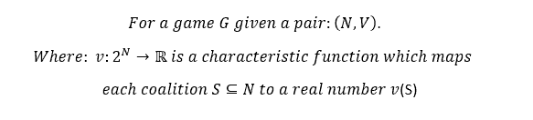
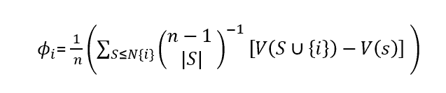
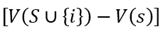
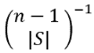
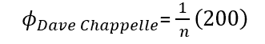
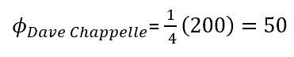

## Introduction to Shapley values, what are they, and how are they calculated

With the rise of explainable machine learning as an integral part of the ever-growing ml-Ops philosophy, Shapley values have been put in the spotlight in the data-science community as an integral part to make the most of applied ml solutions.

This post will be the first of two where I will explore what exactly are they, and what are their use cases in business and applied mathematics. In this first post, I will explain what Shapley values are and how to calculate them for a simple use case, and in the next one, I will explain their use cases and their importance in business operations.

## What are Shapley values exactly?

Originally they were created as a solution in cooperative algorithmic theory problems, a way to calculate the relevance/importance each of the players in a cooperative game had in helping the team achieve their outcome, allowing to fairly distribute the prizes and costs of said cooperation. This only works if the game has multiple rounds, where the effect of having or not having different players can be witnessed, and the level of success can be measured beyond a binary distribution.

Let's understand this better with an example

Let's assume that we decide to build up a startup with a team of founders, a dream team coalition made of Earth's mightiest heroes. They start to cooperate with no clear shareholder strategy in mind and with no idea of what the actual business idea will turn up to be. They are just testing and trying to get an MVP to start obtaining sales.

In our dream team on the marketing side, we have:

- Dave Chappelle, as our PR and main influencer marketing executor

- J.K Rowling as our chief content marketing and organic outreach executor

- Taylor Swift as our PPC outreach executor

So they start to get to work and try experimenting stuff, since they are all quite successful in their respective careers and with really tight schedules, they can't all work full time all months, eventually, they decide to create and run a shrimp restaurant in downtown Los Angeles and start making money.

After 8 months of a relatively successful MVP, they decide it's time to assign base salaries to the employees that will replace them, and decide to use Shapley values for that purpose. They will assign a percentage of the employee salary budget, depending on how much their different marketing channels contribute to actual sales, which marketing channel was the one that had the most and least impact? Who is the top earner of the team? Let's find out!

### How it's calculated

The Shapley value that we are to obtain is in essence the average contribution of each of the players/marketing channels, in all possible permutations in which they participated in the different rounds (months) of the game. You see, that's the first thing about Shapley values, they are formally structured like this:

For a game G (like, for example, the game of getting sales in a successful startup), for N players {Dave, Taylor, and JK } (I'm going to pretend that's her real name from now on) and a function V that maps any number of players to a real number (in this case, we would be talking about a function that would formalize a relationship between the participation of the players, and the sales of the startup).  
  
We will have coalitions of players participating called S, which will be a subgroup of N. In each round a subgroup of all possible players will obtain a value V(s), in this case, sales.

In all this mess, **the Shapley value of each player will be the average contribution that each player gave in the total of the game to change the target variable**. The difference between the average increase or decrease (in case they suck at their jobs) between the average value of the sales, and the average value of sales when that player participates.

So for example, if on average, sales are 300, but in the months that Dave Chappelle works his magic sales go to 350 on average, the Shapley value, the average contribution Dave Chappelle can take in affecting the target is 350-300 = 50. A representative number like this, of what the different players provide to affect the target variable is what we are looking for with Shapley Values.

The way the Shapley values are calculated, allow for perfect aggregation in responsibility. For example, if the average sales when no players participate (maybe because there is a natural demand for shrimp in the location they chose) is 300, but when the three of them participate is 1150, the Shapley values of the three different players will aggregate to 1150-300= 850 If Dave Chappelle has 50 in his average contribution for the entire game, then the other 800 will be assigned to Taylor and Jk's Shapley values.

### Manual calculation Example

Let's look at how this could actually be calculated. Let's look at this as a toy example, imagine that during that 8-month run the revenue was distributed this way:

- Month 1: Only Dave Chappelle executed his responsibilities, and sales where 350. the coalition S = \["Dave Chappelle"\], and v(s) = 350

- Month 2: Taylor swift and Dave Chappelle participated, sales = 750 so S = \[Dave, Taylor\] and V(s) = 750

- Month 3: S = \[Dave,Taylor, JK\] , V(s) = 1150

- Month 4: S = \[Taylor, JK\]. V(s) = 1100

- Month 5: S= \[Jk, Dave\] , V(s) = 450

- Month 6: \[Taylor\] V(s) = 700

- Month 7:\[Jk\] , V(s) = 400

- Month 8: All players got sick so no one participated, sales here were 300, maybe that's the natural demand shrimp has in the location that is placed, who knows. When No players participate that can be considered the average value of sales.

Here we have 8 rounds/month data, and by coincidence, all rounds are one of the possible combinations of players participating. Here we are assuming that participation = 40 hours per week, and that when they participated they all worked their hours to the T.

Let's obtain our Shapley values for one of the players, let's go for Dave Chappele's

### Dave Chappeles shrimp revelation:

So to obtain it, people use a super weird formula that really, is actually just the equivalent of this more easy to understand version:

<figure>

<figcaption>

_Shapley Value formula, We aggregate two elements that we will explain below, and divide them by n_

</figcaption>

</figure>

Basically, the Shapley value of a player _i_ will be the **division** between an aggregation of two elements of all possible groups _S_ (this are all the groups in the different rounds that did not include player _i_ ), and the number of players in the game. This division to the number of players allows making the calculation an "average" representation of all the game.

Two make understanding this calculation easier, we can think as a three-part process, the first two will solve the aggregation and the last step will divide by n. Let's check it out.

#### First element: Aggregated Marginal contribution of set SU{i}

This one is pretty straightforward and represents what we call, the set's S plus player _i_ marginal increase respect to set's S without player _I_. Essentially, the marginal increase caused by Dave's inclusion.

It basically will calculate the obtained target variable for all the groups that were witnessed in the "rounds" of the game where group S also had player _i_ as an addition, and subtract it from the value obtained for the target variable when that same group did not have i. Basically, the changes observed to the target variable when player _i_ is around helping set S versus when he isn't is what will show us later on what _i_ brings to the table.  
  
So, here, basically, we would check all the rounds that Dave Chappelle did not participate in and organize them based on the players that participated, those would be Month 4 (where S = \[Taylor, JK\] , V(s) = 1100) , month 6 (S = \[Taylor\], V(s) = 700), month 7( S= \[Jk\], V(s) = 400) and month 8(S = \["no players"\], V(s) = 300) . This would be all of the possible coalitions S, and their V(s) is what we would be interested in for the formula.

The coalitions that have the same players but also include Dave, are what we would compare them with, this will give us the marginal increase caused by Dave's inclusion. They will be coalitions SU{i} , in this case, we would be talking about :

- Month 1 (SU{i} = \[Dave\], V(SU{i}) = 350) would serve to compare with the coalition of month 8(S = \["no players"\] , V(s) = 300). The marginal increase of this coalition is 350 - 300 = 50.

- Month 2 (SU{i} =\[Taylor, Dave\] , V(SU{i}) = 750) that would serve to compare with the coalition of month 6 (S = \[Taylor\] , V(s) = 700). The marginal increase of this coalition is 750 - 700 = 50.

- Month 3(SU{i} =\[Taylor, Dave , JK\] , V(SU{i}) = 1150) that would serve to compare with the coalition of month 4 (where S = \[Taylor, JK\] , V(s) = 1100). The marginal increase of this coalition is 1150 - 1100 = 50.

- And finally, month 5 (SU{i} =\[Dave, JK\], V(SU{i}) = 450) would serve to compare with the coalition of month 7( S= \[Jk\] , V(s) = 400) . The marginal contribution of this coalition is 450 - 400 = 50.

So, we can see clearly all the values for sales, our target variable for both coalition's S and SU{i}, in this example they are one per month, but in a real-life scenario, we could have multiple months where Dave played by himself, our where JK and Taylor played without Dave. In those scenarios, the value for the coalitions would be the respective average of all the rounds those coalitions played in that manner. This means that, as with any data analysis task, the more data we have the more statistically significant and relevant our conclusions will be thanks to the law of big numbers. **The important thing here is to compare the average result of the target when Dave participated, versus when he didn't. This will give us the increase in the marginal contribution of each coalition after including player _i_**. If

If we aggregate all the increases (as we will have to do eventually, because of the **Σ** in the formula) , we would get 50 + 50 + 50 + 50 = 200. One very important thing to note is that this is not yet, Dave Chappelle's marginal contribution (a.k.a Shapley value), we still need to apply the rest of the formula, we will see why in a second. **This number is the total marginal increase of all the coalitions that included Dave Chappelle**, this can be understood as the total marginal increase in the entire game "caused" by Dave's Inclusion, but, even if Dave's inclusion caused it, it can't all be attributed to himself yet (that's the reason this is not the Shapley value yet).

We are going to operate on this number to find out what part of it, is actually correspondent with Dave's specific contribution, after all, Dave was not the only player in all coalitions of _SU{i}_, so some of this increase should be attributed to those players too (for example because they might have good synergy working with Dave and they become more productive when working with him).

### Second element: Division by all possible combinations of players

After getting the marginal increases, we will multiply (or actually divide, because it's elevated to -1), by the other part of the aggregation, this will be all possible ways that we can organize our players in n-1 (because we are taking out player i) in the absolute value of S ( the rest of players).

An important thing to consider is that _n_ is actually not only the 3 players mentioned in the description of the example, but it will also include "no players", so _n_ is actually 4. S would be the set of all players except Dave Chappelle, so that would be Taylor, Jk, and No player, which means 3. Let's obtain the value of this combination and apply it to each of the coalition's marginal values. Dividing by this combination will allow averaging the aggregation of the different elements calculated before, reducing the total marginal increase in the coalitions by including Dave Chappelle, into an average, an average increase of including Dave Chappelle by round.

So _C(n-1,|S|) = C(4 - 1, 3) = C(3,3) =_ 1.

So summed up, we have 50 +50 +50 +50 = 200. / 1 = 200. **Basically, the average increase by round for coalitions that included Dave Chappelle taking into consideration all players involved.**

### Third and final step: Calculate individual player's contribution to the increase caused by that coalition

Right now our formula looks like this.

And that 200 is the average increase that all players bring to the table, by round, when Dave Chappelle is around. Now the question is, what is Dave's Chappelle-specific contribution to the success of this coalition SU{i}? The answer is just assuming they all had the same probability of bringing value, we divide by the number of players, and that number will represent what each player contributed to the coalition, in this case, we specifically focused on analyzing Dave's Contribution, so this is his Shapley value.

Dave Chappelle's Shapley value, the average contribution he had in every round, was 50. Makes sense if we check, every difference of value between set S and set S + Chappelle was exactly that.

If we run the same process and calculate JK and Taylor's Shapley values, we would get 550 for Taylor Swift and 250 for J.K Rowling. Notice how this would correspond with the perfect aggregation mentioned before, 550 + 250 + 50 = 850, which is exactly the difference we get if we compare S = \['No players'\] to S = \['Dave', 'Taylor','JK'\] in month's 3 and 8. 1150 - 300 = 850.

### Other sources to learn how Shapley values are calculated

If for some reason, this explanation of how the Shapley values are calculated is not enough, here is just this great article from Marko Cotra that is simply excellent in explaining the Shapley value's formula and how it's applied. There is also this awesome online class by Selcuk Ozyurt's youtube channel and this awesome [introductory video by data science garage](https://www.youtube.com/watch?v=u7Om2joZWYs)

Now that we understand what Shapley Values are and what their calculation process is, let's talk about how they are used and what value they are providing to the industry today. Find out in the next post on this topic.
