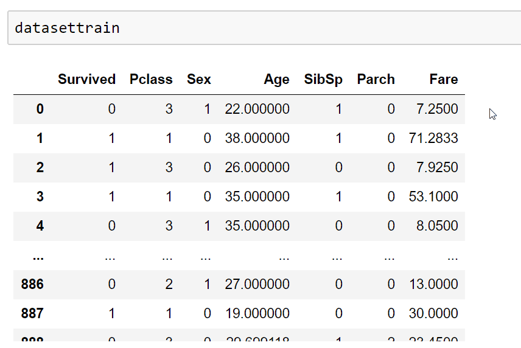
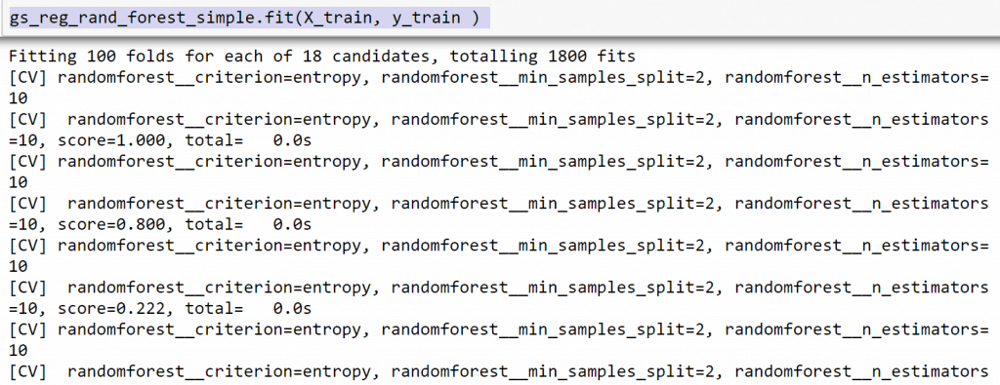
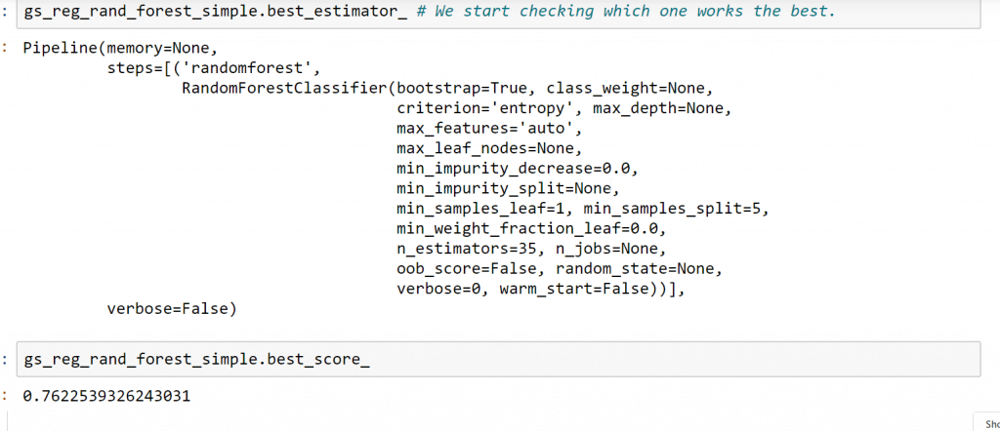

Random forest is a type of algorithm that consists of an ensemble of multiple decision trees. If you have not done it yet, I recommend you to check this post on [decision trees](https://mathforbusiness.com/data-science/analyzing-the-decision-tree-algorithm/) , as they are essential to fully understanding how random forest works.

Basically what we will do, is define a specific type of decision tree with it's set of hiperparameters ( max level of depth) and we will esentially create many of them, the more the merrier. Each split of each of the trees will be done by taking in consideration only a subset of all the feature data, allowing for each tree to train itself with different training sets and therefore, develop different criteria and mathematical relationships between feature and target , as the decision tree algorithm allows.

We could say that how data will evaluate each split, is also a hiperparameter, we can also allow for observations of the subdatasets of each tree to have repetitions, all this is done because, mainly what we want to have is different trees that will identify different parts of the problem space, allowing that, alltogether take in consideration more information that what an individual decision tree could possibly manage.

Finally, once each tree is properly trained, they will start predicting , each tree will make it's own prediction individually and at the end, like K nearest neighbors algorithm , the majority will decide the result. In classification is a simple majority, whilst in regression we have averages.


Pretty simple right? It's even more simple to implement it with scikit learn , let's do it using the titanic dataset from kaggle.

The first stem consists of importing data, as always

```
import pandas as pd 
dataset_train = pd.read_csv('train.csv')
dtaset_test = pd.read_csv('test.csv')
```


Let's clean a little bit the data

```
# let's elminate collumns that do not provide usefull data 
datasettrain = dataset_train.drop(["Name", "Ticket" , "Cabin" , "Embarked" , "PassengerId"] , axis = 1)

# this will transform the categorical gender  variables, into a numerical one 
def categoricaltonum(dataset,category,mapdictionary):
    'this function transforms categorial variable of a dataset into numerical one, we specify as \
    arguments the dataset, the category we want to transform, and we use a dictionary to specify\
    which category will correspond to what created number afterwards'
    
    dataset[category] = dataset[category].map(mapdictionary)
    return(dataset)

# this is equivalent to : winedata['color'] = winedata['color'].map({'red': 1, 'white': 0})


categoricaltonum(datasettrain,"Sex",{'male': 1, 'female': 0})


# and let's fill the null values on the age collumn, with the mean 
train_average =  datasettrain["Age"].mean()

datasettrain["Age"] = datasettrain["Age"].fillna(train_average)
```



Let's separate in training and test

```
# separate train into xtrain and y train

def dataf_sep(dataframeargo):
    X_train = dataframeargo.drop(["Survived"] , axis = 1)
    y_train = dataframeargo["Survived"]
    
    return(X_train , y_train)

X_train = dataf_sep(datasettrain)[0]
y_train = dataf_sep(datasettrain)[1]
```

And now, the moment you have been waiting for, let's see how to implement the random forest with scikit learn

```
from sklearn.ensemble import RandomForestClassifier
from sklearn.pipeline import Pipeline
from sklearn.preprocessing import StandardScaler 
from sklearn.decomposition import PCA 

#from sklearn.ensemble import RandomForestClassifier
from sklearn.pipeline import Pipeline
from sklearn.preprocessing import StandardScaler 
from sklearn.decomposition import PCA 

# Here we are specifying the first  steps of the process. creating our simple regression model 

pipeline_rand_forest = Pipeline(steps = [("randomforest" , RandomForestClassifier())])

# we specify the hiperparameter of the pipeline , by adding __ after the pipeline step name and the argument of it's function in scikit learn

grid_hiperpam_rand_forest = {"randomforest__n_estimators" : [10,20,25,30,35,40 ] ,
                             "randomforest__criterion" : ["entropy"],
                            "randomforest__min_samples_split" : [2,5,10] } 

  # Here we specify te grid search hiperparameters we want to test
# in this case, we just want to test principal component analysis number of variables, specifically from 3 to 9. 


from sklearn.model_selection import GridSearchCV

gs_reg_rand_forest_simple = GridSearchCV(estimator = pipeline_rand_forest , param_grid = grid_hiperpam_rand_forest,
                          scoring = "f1" , cv=100 , verbose = 3) # metemos el pipeline que queremos utilizar  como estimador
# metemos el paramgrid correspondiente , metemos la metrica de scoring que nos interesa, la validacion cruzada que queremos, y el verbose.
```

```
gs_reg_rand_forest_simple.fit(X_train, y_train ) 

```



And with our model trained, we can check our best model.

```
print(gs_reg_rand_forest.best_estimator_)
print(gs_reg_rand_forest.best_score_)
```



After that, we would usually confront the model with the test set, though I won't do that in this post because I'm feeling pretty lazy today.

And that's it, hope you found it useful.
