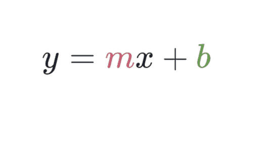
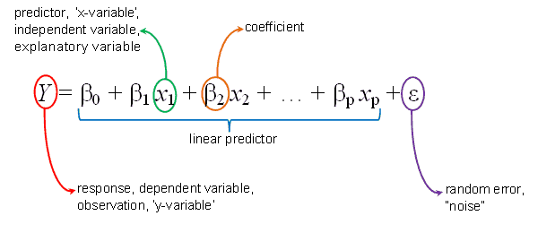
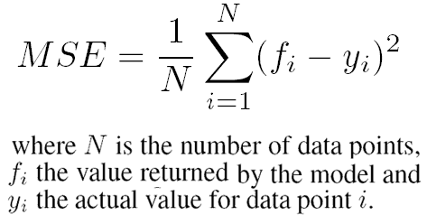
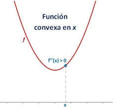
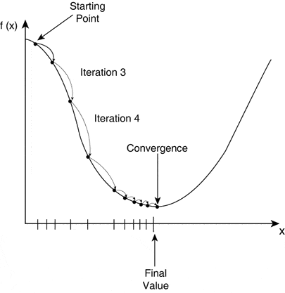
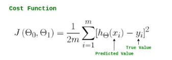
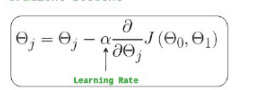
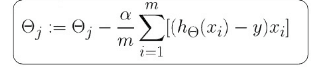

This post is intended to be a hardcore mathematicall explanation, as logical and down to earth as possible, of the linear regression algorithm. This will not be the easiest explanation you will find on the internet about linear regression, we will explain all the logic behind the formulas and math inside linear regression. If you are not interested in understanding the formulas, then this guide is not for you.

The linear regression algorithm is a model used to prove and calculate linear relationship between our features and our target variables. It's the model used when searching for simple and easy to understand relationships between variables. Because of this, the type of equation that represents it is quite simple.

The relationship that we will find will be summarized in an equation/function of this characteristics, basically, when we apply an algorithm we apply a series of mathematical processes to data, to obtain a certain type of relationship, summarized in a function. Applying linear regression summarized the data in the best equation possible that has this form.

Here M represents the relationship coefficient, the effect that the variables it multiplies ( in this basic case, X) have over the feature variable (the one at the other side of the equation, Y). "b" represents the intercept, the general value that Y usually takes when X and all the other variables ( if there where any ) where equal to 0.

For example, if m = 2 , this means that Y = two times X + whatever b is. Applying a linear model is nothing else than applying an algorithm, a mathematical process to calculate the best value of M for each of the features (x1,x2,x3… ) that represent the observable linear relationship in the data it is applied on, and it's correspondent intercept.  
Basically, we will give our algorithm many examples of X and Y, and with its process we will calculate the best M and b possible. If the examples are the dots, in the previous image, the linear regression will represent the equation, that line that best connects the dots.

## The linear regression process:

We just said it, the linear regression will represent the equation, that line that "best" connects the dots, but, what exactly is the best? How do we choose it?. In essence, the best line is that one that has the smallest aggregation of all the distances between it's predicted results of the target variable and the original result. Let me explain:

Each of those points, or data examples, are vectors right? They express coordinates like this \[1,4\] , combinations of values of x and Y that we will feed to the algorithm to train. After training, the algorithm will take a guess for M and B, and it will calculate it's the distance between prediction and the original result ( also called, it's residue). Here is an example:

Imagine that our equation our input example is x = 3, Y = 4. And our equation is Y = 2x + 1 . We will calculate the value, Y = 2\*3 + 1 = 7 . Our predicted Y will be then 7, 7 is the value we predicted but the original value was 4. So the distance, the difference is 3.

We will do this for each one of the data examples used to train the model, and aggregate them. After that, the algorithm will try the same process with another mathematically educated guess of M and b, it will calculate a new equation and calculate the sum of residues again. That will be the criterion for deciding if m and b are good, we will compare their distance with other possible m and bs, and choose the best one, the one with the smallest sum of residues.

In essence, we already understand how all machine learning algorithms work, not only linear regression. The only thing that changes from one to another, is the form of the equation that we try to calculate and the mathematical steps taken on it. The next step to further our knowledge is to understand and actually code our linear regression algorithm. Let's see the mathematical steps that it takes to do this:

## Parts of the algorithm:

An algorithm is a list of processes that take place, in math, they are expressed as formulas, as formulas express no other thing that process and relations.

The linear regression algorithm and many others have basically three parts to its formulation. There are three processes that take place that we need to understand, mathematically define, and finally code.

1) The relationship expression: The equation(s) that will express the relationship between the features and the target variable, in this case for linear regression, that expression includes m and b respectively. This is the what, what do we want to find out.

2) The residue algorithm: How we are going find out and demonstrate that our what, our relationship expression is trustworthy, or if we need to improve it. How are we going to specifically calculate residue and express it's summatory?

3) The cost algorithm, that will basically explain the process we will do and how we will do it, to transform m and b, based on the residue we obtained to calculate through many educated guesses and attempts, the cost function, and with it, having a complete grasp of our cost function, we will obtain our the final m and b of our model.

This might sound weird at first, especially that cost function part, so le' ts tackle this thing one by one

### The relationship formula:

You already know the answer to this one, we basically explained it to introduce you to this.

This is a good opportunity to add, If you have more than one feature variable, the equation would be longer, adding a new m and feature variable for each additional Each one of those feature variables would have their own m coefficient to explain their relationship, msub1, msub2, etc increasing proportionally the dimensions.

Also, people also refer to the M and B variables with other names, for example, beta and epsilon. They are just names, not really a big difference, the important thing is the mathematical operations in the formula, remember that.

### The residue formula

Basically how we will measure in an objective manner how effective is the model predicting. It is the calculation of the total difference between the estimation, and the actual value that the training target variables had.

We will insert this residue formula inside the cost algorithm, basically causing said algorithm to work using the criteria asigned in the residue formula.

The reason because we specify it as a separate element of the whole algorithm, and not included as a part of the cost function is because you can have different criteria to measure the accuracy of the model, this does not affect at the cost algorithm directly. The cost algorithm will operate based on the residue formula, and we will insert the residue formula inside its respective place in the cost algorithm, but the cost algorithm itself does not change.

In another day we will talk about the different residue formulas ( also called metrics ) we can use for our machine learning algorithms, today I will focus on teaching you the basic one: Mean squared error

The MSE (Mean Squared Error) is a regression metric easy to calculate and easy to interpret: It is basically the mean of the squared differences between the real values of the target and the values predicted by our model. This is very good, it can be used in all regression models.

So, for example, going back to our example ,

"Imagine that our equation our input example is x = 3, Y = 4. And our equation is Y = 2x + 1 . We will calculate the value, Y = 2\*3 + 1 = 7 . Our predicted Y will be then 7, 7 is the value we predicted but the original value was 4. So the distance, the difference is 3.

We will do this for each one of the data examples used to train the model, and aggregate them. After that, the algorithm will try the same process with another mathematically educated guess of M and b, it will calculate a new equation and calculate the sum of residues again. That will be the criterion for deciding if m and b are good, we will compare their distance with other possible m and bs, and choose the best one, the one with the smallest sum of residues. "

Our "sum of residues" is equal to calculating the difference for all the interactions ( ypredicted - Y real) and elevating it square. The reason we elevate to square is because that way the result will always be positive, and also be mathematically convenient for most cost algorithms.

You get the gist, now you can have the formula ;)

<figure>

<figcaption>

  

</figcaption>

</figure>

### Cost function and cost algorithm :

The cost function is a crucial part of our algorithm, it will formalize the need of optimizing m and b, based on our specified criterion (the sum of distances) for it to keep the m and b possibilities that cause the least difference between predicted y and real Y for the features.

The cost function, as it name indicates is a function, the mathematical relation of different variables. It represents the relation between the possible values all the m and b relation coefficients can take and the aggregation of residues of the linear regression's prediction. The cost algorithm will be the part of our linear regression algorithm, that will calculate the function that represents this evolution ( cost function) . By expressing in a function how the different m and b , generate different residues, it will be able to define mathematically and in an exact manner the minimum, also known as global minima. Knowing what values of m and b generate the minimum difference between prediction and reality, calculating that way what we need for our linear regression equation.

### Our cost algorithm for linear regression: Gradient descent process

To understand how the cost algorithm works, I want you to imagine a mathematical person, this person wants to apply linear regression. And he is thinking of possible ways to define a cost algorithm, the process he wants to follow. He has no idea how to do it yet.

The Mathematician comes up with the following: Knowing that the equation we want to represent is Y = mx + b, this solution occurs:

I'm going to make the first hit, that is, I'm going to get out of my pocket in a completely random way, a value for m and the intercept to have a complete linear function.This function, knowing that we got it's relation coefficient completely random manner, will probably generate estimations for Y that will be inaccurate, the mean square error metric will not give back a really nice result after I use my randomly generated function to all my training set features values.

Sadly any values for m and intercept I can come up with originally will probably be inaccurate. Because of this, I have to try MANY VALUES, as many as I can, if I do, I might be able to represent the effect increasing or decreasing this values I'm coming up with, will have on the accuracy ( measured by the MSE), This relationship between both, the possible values that m and b might take, and how accurate they are (aka, how large the sum of residues is) will be expressed in what I will call a cost function. The cost that increasing the different values of m and b have on the accuracy of the model.

Having this relation in a function, I will have captured in an expression all the possible values that the accuracy could have for all the possible values of b and the intercept I could come up with, I made sure my training set was statistically big enough, to make sure that the conclusions I get from it are statistically useful. Now, I just need to find in that function the coordinates where the accuracy is at it's best ( in our case and for our predictive interest, this means the coordinates where the sum of residues is it's minimum) , and use the values that generate that residue as the final solution for my model. THose will be the best possible values I can use, the solution to create the predictions that I want.

But for this to work, If I want that minimal point in the function, the coordinate of m and b values that minimize residue to be truly the minimum of the function ( Global Minima), and not just the minimum value I can find ( Local Minima), I need the cost function within the algorithm to be convex, that is, have a form that ensures that using a partial derivative to navigate through it, eventually allows the updates to reach their minimum point. I need it to have the following form as similarly as possible.

If I manage to get my cost function, have this form, and in the Y axis of the same explain the difference between Y predicted and original Y (the sum of residues), and on the X axis the values of the variables we calculate for the equation (myb) the update process (that is, the process in which the mathematician will calculate a new value for myb in each new repetition of the guessing process) will look like this:

Basically, trial and error, trial and error, until we arrive at the value of m and b that give us the minimum difference between Y predicted and original Y. In the case of linear regression, the cost function is not represented in two dimensions as I showed in the previous images ( this was only for you to understand how it works) because we represent at the very least, three variables or dimensions in that cost function: difference of Y predicted and original Y ( the sum of residues) , m and b.

This is graphical representation is quite accurate, we choose the first value we start with randomly, and after that, we systematically decrease them until we reach global minima.

If you have more than one feature variable, what dimensions would increase because each one of those feature variables would have their own m coefficient to explain their relationship, msub1, msub2, etc increasing proportionally the dimensions.

### Our cost algorithm for linear regression: Gradient descent formula

So, now I know the process I want to do, Now I need to translate this process to a mathematical formality, and finally code it.

Let's define the exact mathematical steps our cost algorithm will take:  
I will randomly choose a first set of m and intercept values, with this, I will calculate predictions for all my training set feature variables, producing predicted y values. With this, I will calculate the mean square error of my current interaction of the model, that why I can see how good or bad the model is at predicting right now, how big is its error.

Now I will try this whole process again, by updating, the values for m and the intercepts,again I will feed my feature variables to the new updated linear equation. I will make them update by subtracting or adding themselves (this means, decreasing or increasing their value, for example, if m and b were 2 and 3, in the next interaction will be 2.5 and 3.1, or whatever) , how much they will have to decrease or increase will depend directly in what value of the MSE we obtained in this interaction that why I can assure I'm being thorough. I will do this continuously, repeat this process as many times as I have until I find a set of values that do not reduce the MSE either by being increased or decreased, this will be the coordinates with the lowest MSE, the final values of m and b to my problem.

Simple right? You already know almost everything you need to say you fully understand linear regression and gradient descent, there is only one thing left for you to learn young padawan. How exactly, mathematically speaking does the updating criteria, work? I mean, "depend directly on the value of MSE we obtained" can mean many things and how does it connect to the cost function to generate it?

To explain how the updating process and the cost function connect, first we will express their formulas individually and then we will join them, creating our final cost algorithm.

#### The cost function

Let's start out by using the mathematical names for things.  
Le'ts take a look at our cost function representation again:

Let's identify what each symbol means, The cost function on the Y-axis, represented as J (θ), J ("theta"), on one axis θsub0 representing what we call m and on the other θsub1 representing b or intercept. We are just playing with the official names here.

Knowing that the cost function explains the relationship between m and the intercept ( now θsub0 and θsub1), and the residue formula ( which we have decided it will be Mean squared errors), we can represent the function that corresponds to this graph I just showed you, like this.

Cool right? but, what about the updating? I mean, we have to join our updating process individually

Here H(xi) is the predicted value for Y based on the feature values, Y is the correspondent value. The square is for the mean square error. Usually, the mean would be represented with 1/m but, we use 1/2m because it makes derivative calculation ( which we will use in our cost function ) easier, don't think too hard about it, the 2 will disappear eventually.

#### The updating process: Gradient descent

The exact updating process is gradient descent , even if you get how it works theoretically, I need you to understand a mathematical concept that is key to itś formulaic representation.

Basically, for each and everyone of the variables that represent the relation coefficient, (the m of each feature variable and the intercept) we will "update", change it's value by subtracting from itself the partial derivative of that variable to the cost function. The derivative is nothing else than the mathematical representation of the speed with which a function is increased or decreased by the effect of increasing the particular variable we are deriving from.

Ignore for the moment that learning rate, because The hardest thing to understand from all this is the partial derivative, so let me help you out by explaining it. First, we are going to explain what a normal, total derivative is, then what a partial derivative is, and finally, what a gradient, a directional derivative is. If you want to get the math of this, you need this explanation if you don't know what they are.

The derivative (don't worry if I call it partial or not, it's not important, trust me) is basically how much it is going to increase or decrease a function if the variable we are deriving from is increased or decreased. You calculate it as the division between the function ( for example, f(x)) divided by the value of the variable. For example, let's say we have the f(x) = 3x function, if we calculate the derivative of x, we know that for x = 2 f(x) = 6, so the derivative in that coordinate is 3. ( It's not a coincidence that this, is the relation coefficient between x and f(x), that we use it in our updating process, basically, the derivative is no other thing than the mathematical way to calculate a relation coefficient). For x = 3, the derivative would be calculated as 9 / 3 = 3.

### Derivative and directional derivative:

The hardest thing to understand from all this is the partial derivative, so let me help you out by explaining it:  
The derivative (don't worry if I call it partial or not, it's not important, trust me) is basically how much it is going to increase or decrease a function if the variable we are deriving from is increased or decreased. You calculate it as the division between the function ( for example, f(x)) divided by the value of the variable.For example, let's say we have the f(x) = 3x function, if we calculate the derivative of x, we know that for x = 2 f(x) = 6, so the derivative in that coordinate is 3. ( It's not a coincidence that this, is the relation coefficient between x and f(x), that we use it in our updating process, basically, the derivative is no other thing than the mathematical way to calculate a relation coefficient). For x = 3, the derivative would be calculated as 9 / 3 = 3.

The derivative is the mathematical formalization of what we graphically observe as the slope in a function with only one variable.The slope represent the intensity in wich the function changes, intensity meaning, the magnitude of change, from 2 to 10 is a bigger change in f(x,Y) than from 2 to 2.5)

The linear functions have the particularity, being straight lines as they are, that they always keep the same slope in all their zones or sets of points, they always have the same slope no matter where we calculate it, always change with the same intensity.

Now, there is an important thing to consider, these derivatives measure this effect, the increase that f (x) suffers based on the increment of the variable for two pairs of coordinates, at an infinitesimal level, if x = 3.001, f ( x) would be = 9.003, the reason we do this is because the slope can vary according to the point where it is. The function f (x) = x² will not have the same slope when it is in x = 25 that when it is in x = 4, that is why really when we talk about the slope of this type of functions, we measure the increase that occurs when there is a very very small change, of x = 4 ax = 4.0001, in this case, f (x) are 16 and 16.008001, we could only say d the derivative that is 0.008001 when x = 4 and increase ax = 4.001.

To obtain more usefulness, the equations that represent the relation between the increments for some generic functions have been calculated, it is known that the derivative of (fx) when f (x) is x² is always 2x, the derivative of f (x) when f (x) is x ³ is 3x². When the functions are not linear, representing the increment that f (x) suffers based on x may be more useful to represent it as a function in itself.

#### Now to the "partial derivatives" spot.

When we talk about functions with more than two variables f (x, y) for example, we understand that represented graphically, f (x, y) will represent a new target variable affected by X and Y in the same way that f (x) before represented a target variable affected by X. In this scenario, the effect X and Y individually have on f(x,y) can't be considered as a total derivative, because they will only affect part of the function, while the other variable will affect the other part. Individually they will have less powerfull effect, only a partial effect on the function. So their derivatives are called partial derivatives

The total derivative of the function will depend on the combination of partial derivatives (the increment that the function suffers will depend on the type of increment that its variables suffer) and these increases will depend, of course, on which coordinates they are exactly, as, with total derivatives of one variable functions, partial derivatives are only related to a specific coordinate.

They are calculated exact same way as the total derivatives of one variable functions, by dividing the value of the target variable f(x,y) by the value the variable we are calculating the derivative of has.

If we calculate the partial derivatives of all the variables that form the function, in this case, the partial derivative of X and Y, we can actually represent the total derivatives of the function. The total derivative would be a vector formed by the set of partial derivatives (this is what is known as the gradient), or as the derivative of the function for a set of points.

For example, we can calculate the derivative of f (x, y) at the point x = 2 y = 3, we would calculate the partial derivatives of both and thus we would have the complete derivative. if x= 2 and Y = 3 causes F(x,y) to be 15 their partial derivatives would be 7.5 and 5, the total derivative would be the vector \[7.5 , 5\]

A vector, as you might know can be seen both as the direction in which a function moves inside a graph, being calculated from the derivative, this is the direction at which the function decreases or increases with most slope, most intensively.

### Going back to Our cost algorithm

This is the reason we use it in our gradient descent, we basically for each of the values that affect the cost function we calculate the partial effect they have on it, individually. By subtracting the partial derivative, we make the cost function move in the direction represented by the directional vector, the total effect all the variables have together on the cost function. FInally causing the linear regresion model to change accordingly.

<figure>

<figcaption>

  

</figcaption>

</figure>

If J(θsub0 and θsub1) is the cost function, then θsubJ basically means that this definition applies to all the θ inside the J() function. To each of those θ ( that remember, they represent all the M for our features and the intercept ) we are going to subtract their partial derivative. Moving our coordinate in the cost function closer to the global minima. That derivative is affected by alpha, the learning rate.

### The learning rate

It's an hiperparameter, a variable necessary to our algorithm for which we choose it's value before launching it. Our cost algorithm will not update alpha, rather it will permanently be affected by it.

But what is exactly alpha? Why does it exist?

When working the three dimensions, things are not so simple, in fact, the more feature variables we have the harder it can get for us to find a global minima that is not a local one. It is possible that the cost function depending on our variables (m and b, now called θsub0 and θsub1) has a mountainous shape like the one we saw in the previous image. Due to this, it is possible that when using the derivative to find the directinal derivative, the direction in which we should update the values, we do not reach the minimum of the function, but rather a cliff that is minimum only in the area of values close to it. To avoid this is that in the formula we include an α learning rate ("alpha"), a hyperparameter that will regularize how big the difference between the initial interaction (the values we have for thetas θ, and the values that that we will update.) The smaller the alpha, the smaller the variations in the updates will be, ensuring more security in finding the optimum optima, but requiring more interactions of testing values for θ, a larger training time.

### Combining the formula

We just need to replace inside out gradient descent cost algorithm, the cost function. It is demonstrated mathematically that the end result looks like this

Here the theory of the mathematical demonstration.

I 'm not going to explain all that, this post is long enough jaja, but at least you know there is a demonstration.

Now you know everything you need to fully understand linear regression algorithm. I will post a code example in a future blogpost, to implement it on low-level tensorflow.
