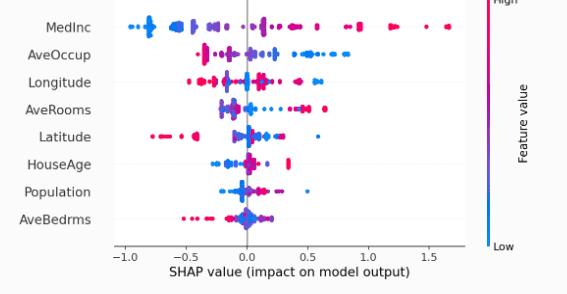
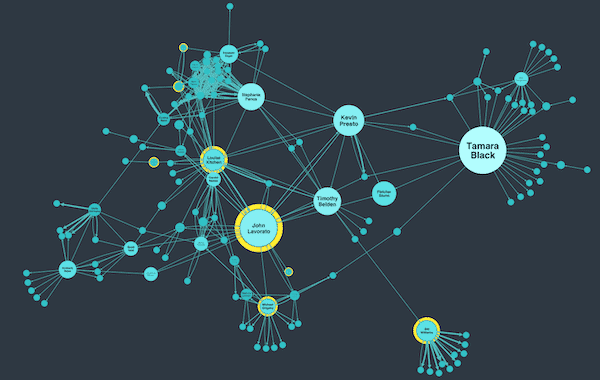

# Introduction to shapley values II: a deep dive into its business applications

Welcome to my second post about one of the coolest solutions to cooperative problems I have seen in a while. Truth be told, I don't check as many of them as you would expect for a guy with a blog, but, even so, no one can take the coolness out of them.

In case you have no idea what the [first post](https://medium.com/@stefanobenco1994/introduction-to-shapley-values-what-are-they-and-how-are-they-calculated-an-example-application-5c9ace09f59) on the topic was about, I essentially explained in detail what Shapley values are and how they are calculated with their formula and an example. Here I will give you a small three-line definition and instead focus on what they are used for exactly in business and their potential.

So, let's give you a short explanation here:

The Shapley value is a solution concept used in game theory that fairly distributes gains and costs to several actors working in a coalition.

Basically, it's a method for calculating how important a specific player or reality is in affecting the outcome of a dependent variable, in a situation where other players and realities that can be measured too also affect said outcome, these players or realities "cooperate" by existing together around the problem, and can occur in different combinations that we call "coalitions".

I'm starting to get carried away with the definition because I guess I really enjoy talking about it, so I will just leave it at that, check the other post for more details. I highly recommend it. Here I'm going to focus instead on what applications and value it's been providing for business.

## What are Shapley values used for?

### Most popular use case: Feature Importance in machine learning

So this is the fun part, generally, Shapley values have become very popular with the rise of MLOPs (machine learning with a high focus on productization) and their uses in facilitating what is called "Explainable AI". Basically by treating the different features we use to predict or calculate on a specific target variable, as players, the importance of each of those features in affecting said variable can be obtained.

The coolness of it comes from the fact that it uses a probabilistic approach based on screening on all different combinations of said features for that purpose. This probabilistic approach allows the solution to be effective no matter how black box the machine learning algorithm is. It's basically a way to estimate an approximate (but not robust enough to be considered statistically significant) causal effect of the different features on the target, that is completely independent of the algorithm itself. It works the same with a deep neural network or with linear regression.

This has allowed data scientists and their business owners that want to make sure they don't have a racist or business illogical solution, to understand better why the predictions a model does happen, without having to compromise to simpler algorithms that allow for logical ways of calculating said importance. Without Shapley values to understand AI, you would need to use simpler (although also very powerful) algorithms like linear regression or Random Forest to have an approximation of feature importance. With Shapley, you can go crazy mystifying your algorithm and applying whacky and obscure math tricks to see if it converges better.

Their main issue is computational cost, the more features you have, the harder it is to calculate. But that's a topic for another day.

Even though this is the main use that has popularized the solution, there are other popular mainstream applications for Shapley values and not-so-popular ones, we will check all that I could find here.

<figure>

<figcaption>

_example of shap values presented graphically obtained for a specific ml model, image obtained from the python [shap library documentation](https://shap.readthedocs.io/en/latest/example_notebooks/overviews/An%20introduction%20to%20explainable%20AI%20with%20Shapley%20values.html)_

</figcaption>

</figure>

### Marketing Attribution models

The second most popular use case right now (although it used to be the first before the rise of MLOps) is a more natural conclusion based on how they were originally thought. Attribution models are a method of assigning in marketing, and specifically inbound marketing, a specific importance to the different marketing channels in causing a lead to convert into a customer through the user journey. This is specifically useful to decide budget and strategy optimizations in said channels. Understanding what traffic sources a company is stronger or weaker in, etc.

So for example, imagine I use Facebook ads, Google AdWords, and youtube content to interact with my audience, and I can track when a specific person interacts with any of those three channels. When a specific customer only saw one channel it's pretty clear which one was the most important in generating that conversion, but, what happens if he checked the three of them before converting? Which one was truly responsible? Usually in business different attribution methods are considered, like first touch or last touch attribution, where either the first marketing channel or the last one before the sale are the ones that have the most importance, or for example, just giving each channel the same importance.

The thing with these methods is that they are oversimplifying that business reality, it can be seen as a very naive approach, it assumes that there is no heuristic difference in the quality of execution of each channel and their effectiveness, which is simply not true. With Shapley values, the closest approximate to the true importance can be calculated, the different channels are treated as players and by studying how different users convert depending on the proportion of each channel they consumed, by iterating through all combinations of delivery many many times, through the law of large numbers a trustworthy approximation of the importance of the channel can be obtained. This importance, as explained before, becomes super useful to help decide what channels to optimize and how to do it.

<figure>

<figcaption>

_cool image that explains marketing attribution_, _source: [adparlor](https://adparlor.com/blog/how-to-choose-the-best-attribution-model/)_

</figcaption>

</figure>

This is another very popular use case for Shapley values, and its implementation along with feature importance, can be easily found with numerous examples in a google search. Now, let's take a look at not-so-mainstream use cases:

### Risk Distribution

A creative application of the Shapley values can be in determining how different assets, either stocks or people (in the insurance market, for example) contribute to the total risk of a portfolio. The idea is very similar to how it's applied for attribution or importance for a feature, although requires two specific conditions that are difficult to observe in real scenarios for this type of use case.

#### The problem of individual player tracking

As mentioned, Shapley values depend on the fact that the game where it's applied has many rounds where different combinations of said players can be observed, and generate a target variable. Normally when working with stocks or insuring people, they are either on or off part of the portfolio without alternating constantly between the two states. Meaning, I could have a particular user be insured for years 2020,2021, and 2022, but the moment he stops, it's not common to see him come back afterwards.

In that sense, generating combinations where the different players (either stocks, or users) come and go is not common. For that reason, there is a need to heuristically or mathematically generate categories of said users and stocks, to encapsulate a representation that can be seen in and out of the coalitions in different situations.

If instead of having Henry Cavill as the player I want to allocate risk to, I have geeky computer enthusiast customer segment, it's much easier to generate the necessary information to obtain Shapley values. The easier the method you use for generating this user representation, the better. The same idea applies to stocks although it's more common there to see a specific asset in and out of a coalition in different time periods.

#### The problem of risk measurement

The second challenge is correctly measuring risk in a target variable that can be easily aggregated and separated but it's still applicable to the different representations of players. I'ts very easy to screw up measuring risk, just look at all the financial crises in history. In that sense, business problems that allow for risk to be simple enough to be classified through, for example, machine learning are more feasible to have shapley values used in this sense.

If we solve these two issues, a case can be made to correctly apply shapley values for risk calculation of different elements of a portfolio.

Here are some pretty interesting papers on the subject, in case you are interested, which each focus on different parts of this mentioned issues. [\[1\]](https://www.tandfonline.com/doi/abs/10.1080/10920277.2007.10597470),\[[2\]](https://link.springer.com/article/10.1007/s10614-020-10042-0),[\[3\],](https://discovery.biblioteca.uoc.edu/discovery/fulldisplay?docid=cdi_proquest_miscellaneous_2345166127&context=PC&vid=34CSUC_UOC:VU1&lang=en&search_scope=MyInst_and_CI&adaptor=Primo%20Central&tab=Everything&query=any,contains,shapley%20values)[\[4\]](https://discovery.biblioteca.uoc.edu/discovery/fulldisplay?docid=cdi_proquest_miscellaneous_1808039483&context=PC&vid=34CSUC_UOC:VU1&lang=en&search_scope=MyInst_and_CI&adaptor=Primo%20Central&tab=Everything&query=any,contains,shapley%20values&offset=20)

### Social network analysis

<figure>

<figcaption>

_Source: t[his super cool social network analysis blogpost](https://cambridge-intelligence.com/social-network-analysis/), from Cambridge intelligence_

</figcaption>

</figure>

A very cool and interesting application that is specifically effective for optimization of viral growth strategies, is influencer and social relevance analysis. Basically, by creating a metric that quantifies how viral or promoted specific rumors, memes or messages are, and by studying what influencers participated in the propagation of said message, leadership and relevance of the social network can be performed to understand what elements of it are most important. This can give strong feedback in deciding how to optimize and improve viral growth by, for example, creating specific collaborations with the most important /effective influencers of the social network.

This same application can be applied to any level of social networks and used to optimize other target variables beyond viralization, for example, productivity or decision-making importance. For example specific studies focus on applying this idea to study inside team leadership in teams where rotation between work partners is common or to study what departments inside a company have more participation in key strategic decisions. This is specifically useful in very big companies with a lot of fat derived from bureaucracy, measuring what departments, or leaders inside of them, participate the most to actually close the issues and make final decisions, can help improve employee retention by rewarding or ignoring specific key employees.

For social network applications, the difficulty comes in generating the data and obtaining it, if social media as the source is used this can be mitigated with paid APIS, but in internal analysis deep thought needs to be put in generating the architecture for the data collection. Also the more abstract the target variable that the players in the coalition will try to increase ( importance in decision making for example, instead of virality) the more risk of theoretically screwing up.

Here some references [\[1\]](https://ieeexplore.ieee.org/abstract/document/5499450),[\[2\]](https://people.dsv.su.se/~panagiotis/papapetrouShapley.pdf)[\[3\]](https://link.springer.com/article/10.1007/s13278-023-01032-9)

### Resource allocation

Another typical use is for distributing a specific valuable, and scarce resource among a group, this group can be parts of an organization, agents in a specific society or organization, and even entire cities in a particular country or state. Scientific documentation in multiple variations of this problem can be found, for example, for inventory distribution between many stores of a specific franchise, based on what the different stores have contributed. In here the players are the stores themselves and rounds are business cycles, the target variable from which we decide might be excess stock, or sales itself.

The most predominant documentation however is in government applications, where the Shapley values are used to help allocate resources like water or energy between different sub-organizations of said government, either states or living units in neighborhoods. When we observe the main issues of this use case for the Shapley values, it makes sense;

And the main issue that I have observed with this application inside businesses, it's not so much that it can't work, but rather, that there are much better options available. Think about it, when the players are all smaller organizations, inside your organization with, for example, data tracking capabilities, metrics that you are measuring, you can set up enough tracking systems on the metrics and the way those elements of the organization operated that allow for more business-specific rules to be created for distributing the resources and measuring their participation.

Why would you use Shapley if you control all the players perfectly? The knowledge of insider information probably allows you to heuristically create a more problem-specific formula that deeply understands the intricacies of the problem and the business in question. In that sense a solution based on Shapley values can serve however as a first naive approach to the problem and baseline for further improvement.

  Shapley seems like an imperfect solution that might only make sense when the players that allocate said resources are independent and not very cooperative to begin with. For example, cooperation between competitors that are pooling resources.

This is the main reason why it makes sense for it to be much more popular in government applications, fulfilling the types of conditions where cooperation exists but not enough to gather the necessary data for a better more precise solution (usually because of government inefficiency). However this is not without challenges either, quantifying cities, states and the such is difficult, not all players start in symmetrical conditions and therefore the risk in opportunity cost to allow their participation is not taken into account by the Shapley model, which becomes especially simplistic for this purpose  if for example, gains or a beneficial resource needs to be delivered to the players, the same can be said with cooperation between competitors. At least in this scenario, the simplicity of the solution and the lack of transparency in data gathering between players (therefore, lacking better options) makes this a preferred approach instead of other alternatives.

References[\[1\]](https://link.springer.com/article/10.1007/BF00133625),[\[2\]](https://pubsonline.informs.org/doi/abs/10.1287/msom.1100.0310),[\[3\]](https://pubsonline.informs.org/doi/abs/10.1287/msom.1100.0310),[\[4\],](https://journals.plos.org/plosone/article?id=10.1371/journal.pone.0227049)[\[5\]](https://ieeexplore.ieee.org/abstract/document/7154987)

## Final Notes

There you have it, these are the main use cases I found for Shapley values, one particular thing I noticed is how feature importance use case brings so much potential by giving a deeper understanding of business models, for example, the feature importance use case can go beyond just the machine learning itself if the machine learning system is part of a dynamic model that tries to simulate an entire business reality or causal graph. In that sense, the explainability capabilities go beyond only understanding how a specific machine learning algorithm works, but also how the business itself works. In that sense, these different use cases can be expanded to more intricate ones when combined with other mathematical tools like simulation. [\[1\]](https://www.frontiersin.org/articles/10.3389/fnut.2022.871768/full).

If there are any other use cases you think are worth mentioning, don't hesitate to reach out!, I'm totally open to feedback.
