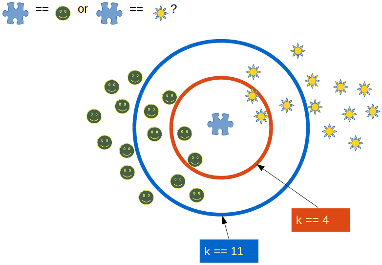
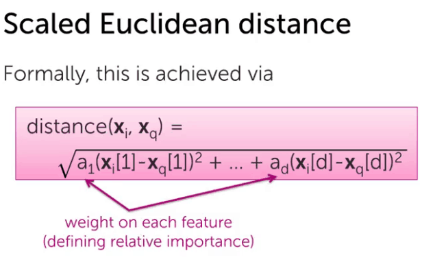
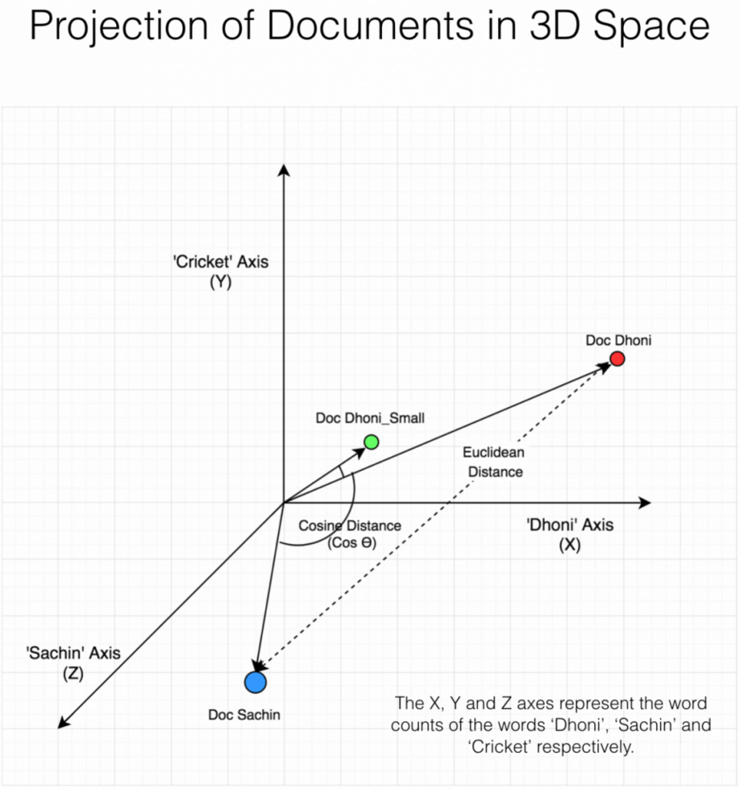
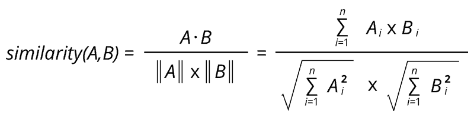

### ¿What is exactly K nearest neighbors?

Providing a training set describing features as a distribution of coordinates and a target variable, we are going to estimate the value of the predicted variable basing the estimation in the value that the closest coordinate of feature variables have in the training set. Basically, each time we have to predict the Y variable, based on a series of features we are going to check in our training set for the result that was given, for the combination of feature values that is the "closest" in the distribution, to our current combination of feature variables.

Think of it this way, if the features we use can be expressed as vectors in a graphical representation, each vector translates as a coordinate in the graph. K nearest neighbors work by checking all the vectors saved in the training set, and calculating which vector has the least distance, to the of the coordinate vector used as input for the prediction. Once that closest vector is retrieved, we simply assign the target variable the value it had in the training sample. If one sample is not enough risk management for us, we can try to be more rigorous by assigning a K number of vectors to compare to instead. If we do this and we assign for example K = 5, the algorithm will check the 5 closest vectors and the target variable value related to them, then it will use the average of that value ( in regression) or the mode ( in classification) of those 5 samples of target variable, to provide the solution. Because in classification, it works with the mode, K always has to be an odd number to avoid this situation

### How does the K nearest neighbor algorithm work?

The key to carrying out the K nearest neighbors is, on the one hand, the k, but on the other, the formula that we use to measure the distance.

We can work with distance formulas that give more weight to one feature than others when calculating the distance. We can affect each feature with a particular coefficient, or we can transform the variables. There are different techniques, and we are going to check two most used cases, one where we add coefficients that represent weight, prioritizing some variables instead of others when calculating

#### Euclidian distance

To ensure that this distance can be represented in a plane we will make the formula of distance 1 / distance calculation, that will ensure that all distance calculated will enter a plane that goes from zero to 1.

Well, to that distance formula we can add coefficients a(x1 - xinput) raised to 2 + a2(x2-x2input) raised to 2 + .... and so. The distance is always equal to the original input minus the feature input of the value to be predicted, raised to the power of two. We subtract to obtain a measure of difference between the point it's comparing to, and the one we are using, we raise to the power of two to make sure that information is maintained positive whilst also giving the calculation some beneficial properties (just like mean squared error) and a, is the coefficient we are multiplying to weight the subjective or not so subjective circumstance of each feature.

Obviously, this has a clear representation in linear algebra, treating all the coordinates as a matrix, the A as a vector, the coordinates to predict as a vector/matrix. All computationally easy to understand.

We can use the same formula for distance, without a coefficient and we would be working with a functional k nearest neighbor algorithm.

### Cosine similarity

It's a generalization of the Pythagoras theorem, that allows us to measure the distance between two vectors, by measuring the cosine of the angle between them.

It is equivalent to calculating the cosine of the angle formed by both vectors if they were part of a rectangular triangle. The imaginary missing side would be the one that allows the formation of the straight angle, and it would represent the distance. and the It is important to understand that it is not a measure of distance per se, the law of cosine is a generalization of the Pythagorean theorem (this allows you to calculate any of the sides of a triangle, knowing the length of its other sides and their angle).

Le'ts get a little bit deeper into how this would actually work when we calculate the distance, we have a set of features right? a feature vector that we want to predict on. We essentially would check, one by one all the vectors in the training set, comparing them to our feature vector for prediction. Graphically, vectors are coordinates. Those coordenates can be seen as part of a function that goes through the origin and that coordinate ( what it is known as a free vector). If we imagine them like this, we have formed a triangle.

In this situation, there is only one missing side, right? The straight angle side. You can see how if we can calculate it, it would represent the distance between the two vectors? That is what we were doing with the Euclidean distance ( if you check the formula again, that is the Pythagoras theorem right there). In cosine similarity, we calculate the cosine of the angle.

Here is an images the might serve as a good comparison , original source is here [https://www.machinelearningplus.com/nlp/cosine-similarity/](https://www.machinelearningplus.com/nlp/cosine-similarity/)

  
The formula looks like this

The cosine, is what we measure, understanding the angle of the triangle can be as effective as undestanding the exact size of the separation, the bigger the angle, the bigger the size will be proportionately.

The formula for the Cosine of the angle between two vectors is derived from the trigonometric difference (between angle a and angle b):

cos(a - b) = (cos(a) \* cos(b)) + (sin (a) \* sin(b)) This formula looks very similar to the dot product formula:

Vect1 . Vect2 = (_x_1 \* _x_2) + (y1 \* y2) where cos(a) corresponds to the x value and sin(a) the _y_ value, for the first vector, etc. The only problem, is that _x, y,_ etc. are not exactly the cos and sin values, for these values need to be read on the unit circle. That's where the denominator of the formula kicks in: by dividing by the product of the length of these vectors, the _x_ and _y_ coordinates become normalized.

Now you understand everything you need to know, about the math behind the K nearest neighbor algorithm. Soon I will publish a code example of it to complement this theory.
