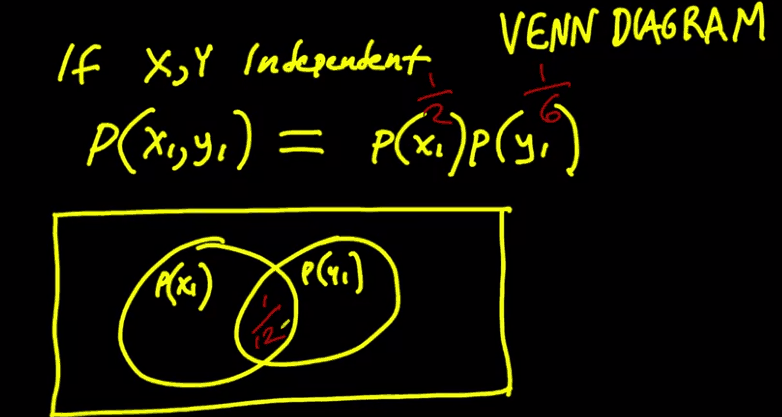
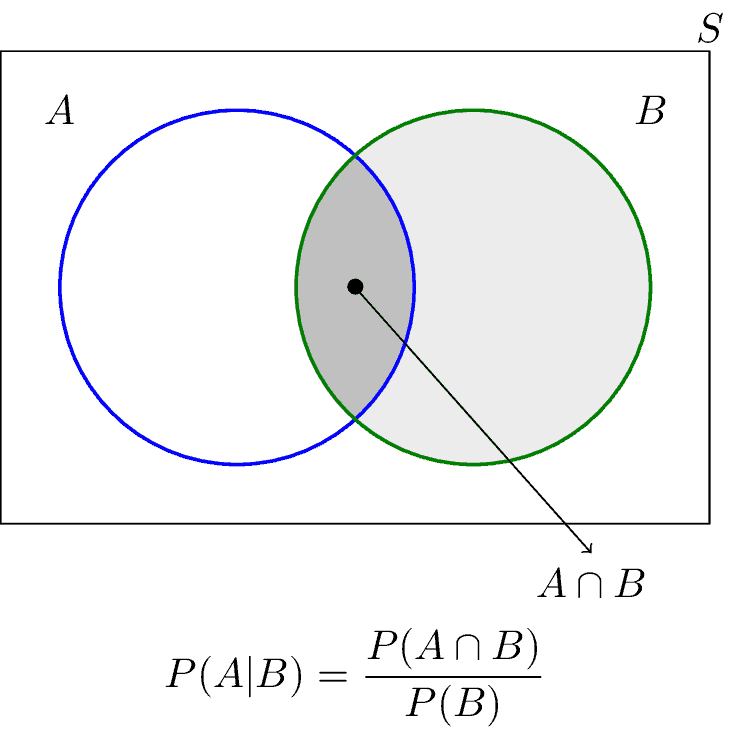
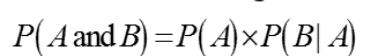
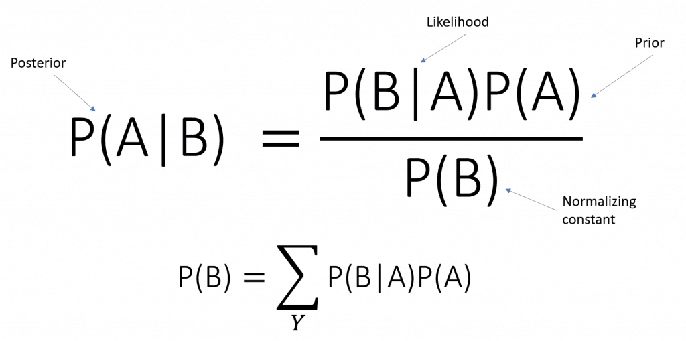
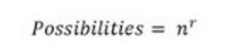
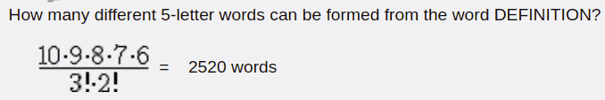

## What is probability

Probability : degree of belief in the certainty of a statement.

We define it as range, between total certainty that something happens, and total certainty that it doesn't, a range between 0 and 1.

It is represented P(X) as the probability that X happens, and P(~X) as a probability that it doesn't. They are inversely proportional if P(x) is 1, then P(~x) is 0. This is the rule of no midle ground.

A probability distribution is the collection f possibilities regarding to the state of the real measure. The probability distribution of X would represent the list of possible values X can have, and each of those values probabilities.

When there is no way to know which value is more probable, their probability is 1/nposible values.

## Joint probability

The probability that two events from two different distribution are true. A is true and B is true,there are two ways to study this, depending if their probabilities are independent, because they are unconnected events, or if they are connected events that affect each other.

When they are unconnected, the probability of both happening is just the probability of one times the probability of the other.

## Or probability

The probability that either one event occurs, or the other, or both. If we added the two distributions (circles) together,we would count the central area twice, since that areas range of values in the distribution happen on both, for this reason, this probability is P(A) + P(B) - P(AnB)

## Dependent Joint probability (conditional probability)

Let us consider A and B are not independent because if A occurred, the probability of B is higher. When A and B are not independent, it is often useful to compute the conditional probability, P (A|B), which is the probability of A given that B occurred, in this scenario the probability of A knowing B is the same as the part of the probability of both happening that does not correspond to the probability of b happening independently,

P(A|B) = P(A ∩ B)/ P(B)

The chance of both things happening is the chance that the first one happens, and then the second one happens knowing or given the first happened.

P(A ∩ B)= P(B) \* P(A|B)

## Bayes theorem:

We know that the probability of P(AnB) is the same as P(BnA), and we know respectively each is equal to P(B) \* P(A/B) and P(A) \* P(B/A) , we can use this information to calculate the probability of any individual, A or B combining them in a formula as we see fit.

Also, the probability of any individual variable is the probability that that variable happens, knowing that the other variable happened, plus the probability that the variable happened knowing that the other variable didn't happen. Basically, no matter the scenario we are accounting for the possibilities that A happened.

## Permutations

### Permutation where n is formed by unique elements and we allow repetition of those elements when creating groups

groups of n elements can have each of the possible elements more than one time, each time with a different group. The probability is n^m

### Permutation where n is formed by repeated elements

Whe we have n elements, but only less than n different elements.  
Probability of certain events occurring in certain order, here the order matters a lot. Specifically, n events happening ordered in groups of m elements, where each change in order even if it includes th same element, is considered a new group.

placing 5 elements in groups of 3, is the probability of each of the possible elements placed in one group of m numbers happening, n factorial! / n-mfactorial!, with that denominator we make sure to exclude the number of elements that will not form the group in our probability calculus.

Therefore, our result would be 5!/(5-3)!= 5_4_3_2_1 / 2_1 = 5_4\*3 = 60

Usually, the probability of placing n elements in different orders is nothing else that the probability fo each element being picked,one time. If no repetitions are allowed, the probability of being placed is reduced each time one element is placed.

### Permutations with repetition:

In this case, we would calculate the possibilities the same way but, we would also divide by the factorial of the number of times each element repeats itself

Imagine we have the word definition, how many 5-letter words can we create with its letters? We would make the factorial of 10! / by the factorial of (10-5) + the factorial of 2 ( the letter n repeats itself two times) and the factorial of 3 ( the letter n, three times). We do this because actually, having a letter repeated here, decreases the chances of new groups, even if we take order into account

## Combinations:

How many groups can be created for n elements distributed in groups of m. Here order does not matter, and in this case obviously,the probabilities are less than in permutations.

Basically just like before, we use the factorial of all possible values, but now, different orders have the same effect as repetitions, so we need to take them out.

Factorial of n! / factorial of (n-k)! (Just like before) but now also times factorial of k! ( as k represents the redundancy)

